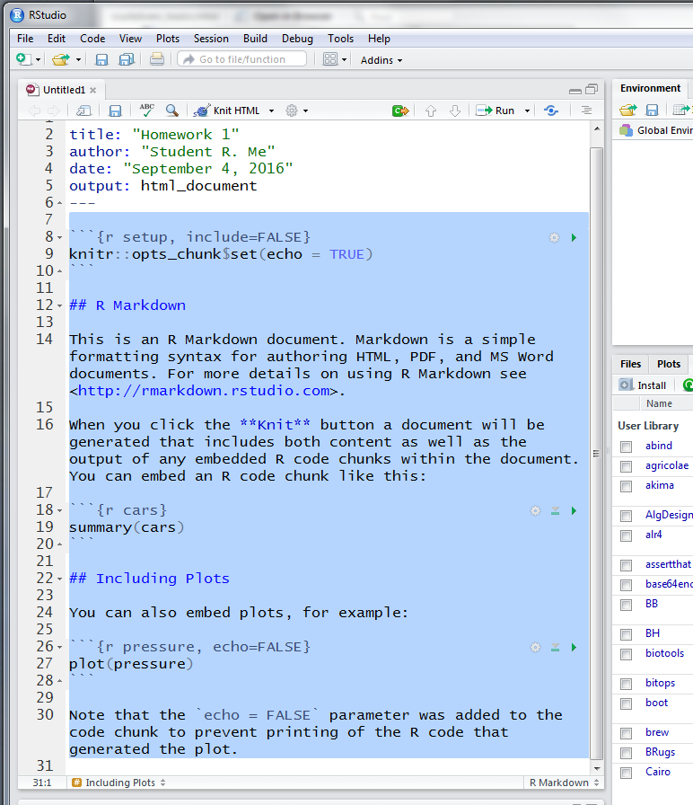
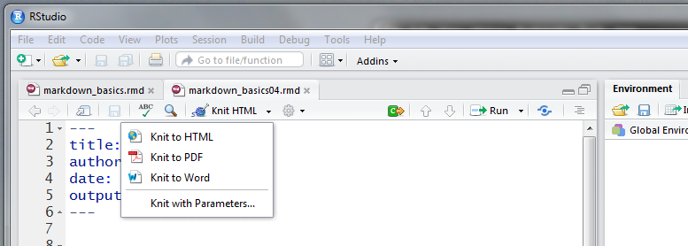
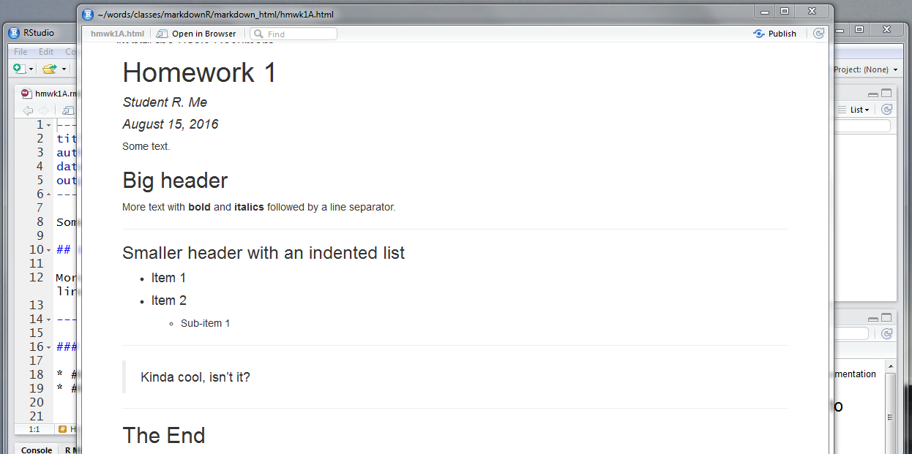

---
title: "KNIT the RMarkdown Document"
output: rmarkdown::html_vignette
vignette: >
  %\VignetteIndexEntry{0204-rmdKNIT}
  %\VignetteEngine{knitr::rmarkdown}
  %\VignetteEncoding{UTF-8}
---


<!-- set root directory here
```{r global_options, include=FALSE}
knitr::opts_knit$set(root.dir = "~/words/classes/markdownR/markdown_html")
knitr::opts_chunk$set(warning=FALSE, fig.align="center")
```
-->

```{r, include = FALSE}
knitr::opts_chunk$set(
  collapse = TRUE,
  comment = "#>"
)
```

Last update: `r format(Sys.time(), '%d %B %Y')` (V2019.2)

---

##
It's really quite simple ...

So far we've seen how to develop a basic RMarkdown document.  However, we've not yet seen how to actually build the desired document type from the code.  So how is it done?

The process of converting the RMarkdown text to the preferred document type (e.g., HTML, PDF, MS WORD) involves several steps.  The process first involves the function `render` from within package `rmarkdown`, which feeds the **.rmd** file (what we're now learning how to build) to package [`knitr`](https://cran.r-project.org/web/packages/knitr/index.html).  `knitr` creates a new markdown output **.md** which is converted to the desired document type using the function `pandoc` from package `knitr`.

Whew!  Probably too much detail, right?

Luckily, these steps have been condensed into a single dropdown command within RStudio.  The process is called **Knit**.

From within RStudio open the **hmwk1.rmd** template saved at the beginning.  For now it should only show the YAML.  Add some headers and text, some boldface and italics, a list, and even a blockquote if desired.  Something similar to that shown in Fig. \@ref(fig:f05) will work.

<!-- set figures directory here 


out.extra='style="background-color: #ffffff; padding:10px; display: inline-block;"'
--> 

```{r f05, echo=FALSE, fig.cap="Some simple text for a RMarkdown document.", out.width = '50%', fig.align="center", out.extra='style="background-color: #ffffff; padding:10px; display: inline-block;"'}
knitr::include_graphics("figures/md05.PNG")
```

Once that is done, click the $\blacktriangledown$ (carrot) by **Knit** and select the type of document desired.  For now select **HTML** (Fig. \@ref(fig:f06)).

<!-- set figures directory here 


out.extra='style="background-color: #ffffff; padding:10px; display: inline-block;"'
--> 

```{r f06, echo=FALSE, fig.cap="GUI dropdown for \"kniting\" the document.", out.width = '50%', fig.align="center", out.extra='style="background-color: #ffffff; padding:10px; display: inline-block;"'}

```

The **R Markdown** panel (lower left of your RStudio panels) will scroll through output, and a new window will popup with the **knitted** document.  Assuming no errors (we'll deal with those in a while ...) you now have a completed HTML document that can be opened in any browser.  The HTML document will also be saved in your default working directory.

<!-- set figures directory here 


out.extra='style="background-color: #ffffff; padding:10px; display: inline-block;"'
--> 

```{r f07, echo=FALSE, fig.cap="A completed RMarkdown HTML document.", out.width = '50%', fig.align="center", out.extra='style="background-color: #ffffff; padding:10px; display: inline-block;"'}

```

You're done !!  You've built your first RMarkdown document in HTML format (Fig. \@ref(fig:f07)).
