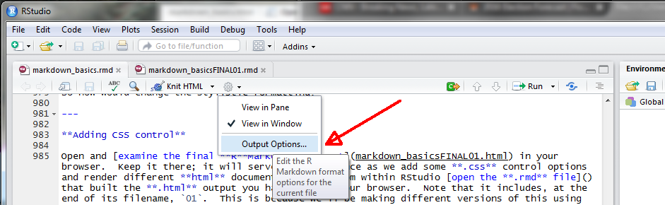

---
title: "Some Additional Topics"
output: rmarkdown::html_vignette
vignette: >
  %\VignetteIndexEntry{0208-rmdAdditionalTopics}
  %\VignetteEngine{knitr::rmarkdown}
  %\VignetteEncoding{UTF-8}
---


<!-- set root directory here
```{r global_options, include=FALSE}
knitr::opts_knit$set(root.dir = "~/words/classes/markdownR/markdown_html")
knitr::opts_chunk$set(warning=FALSE, fig.align="center")
```
-->

```{r, include = FALSE}
knitr::opts_chunk$set(
  collapse = TRUE,
  comment = "#>"
)
```

Last update: `r format(Sys.time(), '%d %B %Y')` (V2019.2)

---

## Overview

As noted at the start of this RMarkdown vignette, there's almost unlimited potential for RMarkdown--based documents.  If you made it through the first section of this document, you can easily create a HTML document.  And if you're in one of my classes, a RMarkdown document is how I'll be expecting your homework to be delivered to me.  So experiment with different ways to document your work; that's the best way to learn RMarkdown syntax.

Even with an almost unlimited potential, there are several advanced topics for RMarkdown to be considered.  These include, in no particular order:

* Minor syntax issues to make your RMarkdown life easier
* Use of CSS to control HTML document formatting
* Outputting in other document formats

## Minor syntax issues to make your RMarkdown life easier

### Setting a working directory other than default 

RMarkdown defaults to your R home directory, which is `C:\Users\USRNAME\Documents` in a Windows OS, `/Users/USRNAME` in a MAC OS, and `usr/home/USRNAME` on Linux builds.  Depending on how you prefer to organize your workflow on a personal CPU, a default to you OS home may, or may not, be desired.  It is not for me, given the co--mingling of research day--to--day work life, and teaching responsibilities on the same CPU.

So exactly how do you "set" a home directory different from default?

Because the rendering process works through package `knitr`, the working directory for `knitr` is set with the following option `root.dir=`:

    ```{r global_options, include=FALSE}`r ''`
    knitr::opts_knit$set(root.dir = "~/PATH/WORK_DIR")
    ```

Setting the working directory occurs within the `{r global_options}`.  It is best that the RMarkdown document options be set immediately after the YAML.  Operationally, once this directory is set any future directory changes should nested under this working directory.  

Although it possible trick RMarkdown into changing among many different directories within different **chunk**s, using, for example, `setwd(DesiredPATH)`, it is generally not recommended.  Use the `root.dir=` as shown above and then nest directories underneath.  You can always use full paths within a **chunk**, but this can become tedious.

**NOTE** that while `setwd(DesiredPath)` can be used in a **chunk**, it is valid for ONLY that **chunk** and disappears when the next **chunk** is evaluated.

### Inserting comments into a RMarkdown HTML document 

The standard format for a HTML comment -- leading as `<!--` and ending as `-->` -- can be inserted into a RMarkdown document.

```
<!-- Any text, code, or whatever between these arrows will be ignored -->
```

The comments below  will be ignored during rendering of the RMarkdown document.  I often use them as metaphorical breadcrumbs to help remind me of options I have set.

    #### HTML comments as breadcrumbs
    <!-- set root directory here --> 
    <!-- suppress R warnings --> 
    ```{r global_options, include=FALSE}`r ''`
    knitr::opts_knit$set(root.dir = "~/PATH/WORK_DIR") 
    knitr::opts_chunk$set(warning=FALSE)
    ```

### Rendering and knitting a RMarkdown document from outside RStudio

RStudio is by far the easiest approach for creating a RMarkdown document.  

Even I -- an acknowledged Curmudgeonly Dinosaur who prefers Vanilla R for day--to--day coding -- use it.  However, as noted at the start of this vignette, command line code from within Plain Vanilla R can be used as well to create a RMarkdown document.  I do not show how to use command line RMarkdown here.  Simple google searches using phrases like "command line r markdown" return numerous hits that can be explored if desired.  

My recomended Bottom Line, however, is to use RStudio to build RMarkdown documents.

## Stylistic Control for HTML Formatting

One of the principal ways to control RMarkdown document formatting is through use of so--called templates, be it a template for HTML output, MS WORD, or PDF.  In the case of HTML, this control is best implemented through use of [CSS control](http://www.w3schools.com/css/css_intro.asp).  Not surprisingly, there already exists several "canned" CSS--type control files available for RMarkdown within the RStudio environment.  Although they are not represented within RStudio as CSS files *per se*, but are instead referred to as "Highlight" and "Theme," they operate in the same fashion.  

For example, by now you (should) have noticed that the output of the HTML document describing how to use RMarkdown differs from the example outputs.  This is because my RMarkdown has CSS control while the rendered examples are in the RStudio default for HTML.  This default has no CSS control.

So how would change the stylistic formatting?

### Adding stylistic control from within RStudio

Open and [examine the final RMarkdown document](https://tedwards-github.github.io/useRfiles/rmd-files/rmd_basicsFINAL01.html) in your browser.  Keep it there; it will serve as a reference as we add some stylistic control options and render different HTML documents.  Next, [download the **.rmd** file](https://tedwards-github.github.io/useRfiles/rmd-files/rmd_basicsFINAL01.rmd) that built the HTML output you have open in your browser.  (Where this file downloads is contingent on your browser.) Note that it includes, at the end of its filename, `01`.  This is because we'll be making different versions of this using different stylistic formats, and the `01` will be a counter.

Stylistic control is added in the YAML.  To embed stylistic control, click the $\blacktriangledown$ (carrot) to the right of the tool symbol, and navigate the drop-down to **Output Options** (light blue color) (Fig. \@ref(fig:f08)):

<!--

out.extra='style="background-color: #ffffff; padding:10px; display: inline-block;"'
--->

```{r f08, echo=FALSE, fig.cap="GUI dropdown for selecting output options.", out.width = '50%', fig.align="center", out.extra='style="background-color: #ffffff; padding:10px; display: inline-block;"'}

```

Click the **Output Options**.  This opens a new drop-down.  At the top you can choose HTML, MS WORD, or PDF.  For now, make sure HTML is selected.  Note that the **syntax highlighting** and **Apply theme** boxes are checked, and that they show **default** (Fig. \@ref(fig:f09)).

<!--

out.extra='style="background-color: #ffffff; padding:10px; display: inline-block;"'
--->

```{r f09, echo=FALSE, fig.cap="GUI dropdown for selecting highlight and theme options.", out.width = '50%', fig.align="center", out.extra='style="background-color: #ffffff; padding:10px; display: inline-block;"'}
knitr::include_graphics("figures/md09A.png")
```

Here is where you can add one of RStudio's "canned" formats.  First, make sure you've opened the `markdown_basicsFINAL01.rmd` file in RStudio.  Next, follow the process above and pick a syntax from the list.  I selected **haddock** (mostly because it is a wonderful fish for eating, not for any specific RMarkdown reason).  Before hitting **Ok** be sure you are looking at the YAML in the `markdown_basicsFINAL01.rmd`.  Hit **Ok**, and observe how the YAML has changed.  It now includes; nested under the YAML `output: html_document:` a new option called `highlight: hadddock`.  

```
#### YAML now includes RStudio highlight option that links to a CSS-type file
---
title: "A Final RMarkdown Document in HTML Format"
author: "Student R. Me"
date: '`r format(Sys.Date(), "%B %d, %Y")`'
output: 
  html_document: 
    highlight: haddock
---
```

Last, save the document as `02` version, and then knit.  [Open the `02` HTML version](https://tedwards-github.github.io/useRfiles/rmd-files/rmd_basicsFINAL02.html) in your browser and compare to the [`01` HTML version](https://tedwards-github.github.io/useRfiles/rmd-files/rmd_basicsFINAL01.html).  The first (and only) difference is the code syntax, and it is colored.

Next, pick a theme (I chose cerulean, liking deep sky blues) and save the change with your chosen theme as version `03`.  Once again, the YAML will change - `theme: cerulean` has been added - as will the knited document.  Once again, it differs.  In this example, the YAML `output: html_document:` will now also include a `theme: cerulean`.

```
#### YAML now includes RStudio highlight and theme options
---
title: "A Final RMarkdown Document in HTML Format"
author: "Student R. Me"
date: '`r format(Sys.Date(), "%B %d, %Y")`'
output: 
  html_document: 
    highlight: haddock
    theme: cerulean
---
```

Try as many highlights and themes as you wish.  

### Adding CSS control from within RStudio

Much like `highlight:` and `theme:`, the `css:` call is placed within the the YAML `output: html_document:` section.  An example would be  `css: FILENAME.css`.  **NOTE** you must set `theme: null` or the render will crash.

```

#### YAML now includes css: option that explicitly links to a CSS file
---
title: "A Final RMarkdown Document in HTML Format"
author: "Student R. Me"
date: '`r format(Sys.Date(), "%B %d, %Y")`'
output: 
  html_document: 
    css: FILENAME.css
    highlight: haddock
    theme: null
---
```

You can either build your own CSS file, obtain one from elsewhere, or obtain and modify an existing CSS file.  They are relatively [simple to build](http://www.w3schools.com/html/html_css.asp) from within any basic text editor.  A great place to start for RMarkdown-related CSS files is this [GitHub site](https://github.com/jasonm23/markdown-css-themes), which includes a dozen or so different CSS files you can use.  There's a [companion website](https://jasonm23.github.io/markdown-css-themes/) that allows you to see differences among the RStudio styles.  Check it out.

Because the CSS file controls stylistic elements such as font, size, and color, it best to either not include the `highlight:` and `theme:` options within the YAML, or set them to `null`, if a CSS control is being implemented.

## Other RMarkdown Formats

As previously noted, there exist numerous [formatting options for Markdown documents](https://blog.rstudio.org/2016/03/21/r-markdown-custom-formats/).  Two default formats within RStudio are MS WORD and PDF, both of which are accessible from the same drop--down menu location where the `Knit HTML` is found (Fig. \@ref(fig:f10)).

<!--

out.extra='style="background-color: #ffffff; padding:10px; display: inline-block;"'
--->

```{r f10, echo=FALSE, fig.cap="GUI dropdown for PDF and MS WORD outputs.", out.width = '50%', fig.align="center", out.extra='style="background-color: #ffffff; padding:10px; display: inline-block;"'}
knitr::include_graphics("figures/md10A.png")
```

### MS WORD Format

To convert the RMarkdown document to a MS WORD format simply click the `Knit to Word` on the dropdown shown above.  That's all there is to it.

The [MS WORD document returned](https://tedwards-github.github.io/useRfiles/rmd-files/rmd_basicsFINAL01.docx) is typically "Read--Only," and might require saving or changing the View (i.e., View => Edit Document) so that it can be edited if desired.  This is largely system dependent and can only be determined by experimentation on your part.  

The `Knit` process does a reasonably good job of converting most figures, although occasionally you may have to return to your R code and rescale some of the plot elements, such as the `cex =` used in text labels or legends.  Note below how the YAML in a `Knit to Word` document looks; output has changed from `html_document` to `word_document`.

```
#### Basic MS WORD YAML 
---
title: "A Final RMarkdown Document in HTML Format"
author: "Student R. Me"
date:  '`r format(Sys.Date(), "%B %d, %Y")`'
output: 
  word_document: default
--- 
```

But what if you do  not like the MS WORD defaults, which here are blue headers, a Cambria font of 12 pitch, as well as other defaults?  

Much like we used a CSS file to control format of HTML documents, we can use a MS WORD template to control the stylistic format.  However, unlike there being several CSS--type defaults for HTML format in RStudio, as well as several CSS options found on GitHub and elsewhere, there are few "canned" MS WORD templates available.  You need to build one.  The steps are reasonably simple:

* Build a **.rmd** template file containing all possible, desired output you can ever imagine in a MS WORD document, such as:  
    * Headers, bold, italics, and all other format controls described above  
    * External web links  
    * Embedded pictures / video  
    * Tables  
    * Mathematical symbols and equations  
    * Embedded R code, including a plot 
* Knit the document as MS WORD output  
* Open the MS WORD document  

Once open, from the `Home` tab click the lower right of the `Styles` section.  This will open an adjoining panel of Styles options to the right (Fig. \@ref(fig:f11)). 

<!--

out.extra='style="background-color: #ffffff; padding:10px; display: inline-block;"'
---> 

```{r f11, echo=FALSE, fig.cap="Creating a MS WORD template: accessing the Styles Section.", out.width = '50%', fig.align="center", out.extra='style="background-color: #ffffff; padding:10px; display: inline-block;"'}
knitr::include_graphics("figures/md11A.png")
```

Highlight a segment of the document, such as text in the first paragraph.  Next, scroll down the `Styles` panel until you find a highlighted section (here, First Paragraph).  This represents the MS WORD Style associated with that section of the document.  Click the First Paragraph symbol $\blacktriangledown$ (carrot), which opens a drop--down.  Click `Modify`, and then change the format to whatever is preferred.  The `Modify` merely implements any of the possible format options found in a standard MS WORD document (Fig. \@ref(fig:f12)).  

<!--
 
out.extra='style="background-color: #ffffff; padding:10px; display: inline-block;"'
---> 

```{r f12, echo=FALSE, fig.cap="Selecting a section of MS WORD and applying a style.", out.width = '50%', fig.align="center", out.extra='style="background-color: #ffffff; padding:10px; display: inline-block;"'}
knitr::include_graphics("figures/md12.png")
```

Repeat this process for all snippets of output that you wish to format.  Once completed, save the document, giving it some sort of name like `word_RMarkdown_templateV01.docx`.  The final step is to reference the MS WORD template in the YAML using the `reference_docx:` option.  As the RMarkdown file is processed, it uses the specified formats in the `reference_docx:`.  There will be, on occasion, formats that simply will not cross--over from RMarkdown to a MS WORD document, such as a system calls.  You will learn what these are mostly through personal trial and error.

```
#### MS Word YAML with reference to a WORD template
---
title: "A Final RMarkdown Document in MS WORD Format"
author: "Student R. Me"
date:  '`r format(Sys.Date(), "%B %d, %Y")`'
output: 
  word_document:
    reference_docx: word-styles-reference-01.docx
--- 
```

One final note.

The process to construct a MS WORD document using RMarkdown is very well described in [a post by R. Layton](http://rmarkdown.rstudio.com/articles_docx.html), and I encourage you to check it out.  He goes into much greater detail that I describe here.  Remember, you need only build this MS WORD template once and then access it when you wish to use RMarkdown to construct a MS WORD document.  It can take a while until you are satisfied with the formatting, but once the template is constructed and saved it is very easy to build MS WORD documents that mirror your preferred HTML format. 

### PDF format

Conversion to PDF directly from RMarkdown is somewhat complex, mostly because it requires installation of TeX.  There's a separate vignette for PDF output that will walk through installation of TeX on your CPU. 

#### The Lazy Person's Approach

Don't fight City hall.  Build the MS WORD document using a template of your choice, then convert the document to PDF in MS WORD. 
