<!--
---
title: "Creating PDFs in RMarkdown: Installation of TeX"
output:
  bookdown::pdf_document2:
    fig_caption: yes
    toc: false
    toc_depth: 3
    keep_tex: TRUE
    number_sections: yes
  bookdown::html_document2:
    fig_caption: yes
    highlight: haddock
    number_sections: yes
    toc: yes
    toc_depth: 3
    toc_float: yes
urlcolor: blue
---
-->

<!-- set root directory here --> 
```{r global_options, include=FALSE}
knitr::opts_knit$set(root.dir = "~/words/classes/baseR_ALLversions/baseR_installmiktex")
knitr::opts_chunk$set(warning=FALSE,error=TRUE)
```

Last update: `r format(Sys.time(), '%d %B %Y')` (V2019.2)

---

## Purpose of this Vignette

This vignette explains the installation process for [MiKTex](https://miktex.org/) or an alternative, [TinyTeX](https://yihui.name/tinytex/), and how to use it to create PDF documents.  Either MiKTeX **or** TinyTeX -- **but NOT both !!** -- is a required addition to your CPU OS if:

* You intend to create PDF output from a [RMarkdown document (`.rmd`)](https://rmarkdown.rstudio.com/) from within RStudio.
* You intend to use the [**RN**ot**W**eb Sweave (`.rnw`)](https://support.rstudio.com/hc/en-us/articles/200532247-Weaving-Rnw-Files) process to build PDF output from within RStudio.
* You intend to use [LaTeX--related software](https://www.latex-project.org/) to build documents either from within, or outside, of RStudio.

And if you're reading this it is because you opted **not** to take "The Lazy Person’s Approach" as described in the previous module

  *Some Additional Topics* => *Other Rmarkdown Formats* => *PDF Output*.

## Some TeX'y--Type Background and History

### (This is Merely a FYI and Presented For the Curious)

TeX, LaTeX, TeX Live, MiKTeX, BibTeX, TeXmacs, MathTeX -- lots of acronyms that include "TeX."  So what is this TeX'y thingy, and how does it relate to document production from within RStudio (and elsewhere)?

Let's start with what defines TeX.  TeX itself is a nothing more than a set of typesetting commands for formatting a document.  An example command is `\textit{word}`, which is the TeX command to italicize a *word*.  

TeX is not too friendly to end--users (my opinion) as a set of stand--alone commands from which to build a document, so groupings of commonly used commands were eventually wrapped into packages of command--groups.  These grouping were, in essence, executable bundles of formatting commands.  One of the more common of these groupings executable formatting commands is LaTeX.

Over time end--user desires for increased functionality led to enhanced modifications of bundled groupings of LaTeX into larger sets that essentially format an entire document.  The most well--known of these is pdfTeX.  (Easy to figure what type of document **pdf**TeX creates, right ??)

Last was the integration of the various executables into distributions of TeX--based commands.  Distributions not only allowed for a structured environment for building documents -- all the "groupings" from above -- but also added even more enhancements, such as the common BibTeX output associated with published journal articles (Fig. \@ref(fig:f01)).

<!--
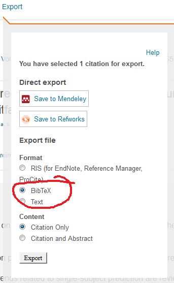
--->

```{r f01, echo=FALSE, fig.cap="BibTeX is a very common export format for all published articles.", out.width = '30%', fig.align="center", out.extra='style="background-color: #ffffff; padding:10px; display: inline-block;"'}

```

MiKTeX, where we're headed with all this, is a distribution as well.  As is another distribution called TeX Live.  [TinyTeX](https://yihui.name/tinytex/), a recently--developed alternative to MiKTeX for interfacing with RStudio, is a subset of TeX Live which, as we discussed above, is another grouping of TeX--based commands.

So when you encounter the terms, you can basically ignore the TeX part -- that's seriously down in the programming weeds -- and focus on LaTeX as first logical groupings of typesetting commands on which a document can be based.  

By way of (a poor, perhaps?) analogy, R itself is the LaTeX of analysis, and RStudio is a distribution that adds all sorts of goodies to enhance R's fundamental capabilities.

---

# Some first Steps

No matter what your CPU OS is, you need to first install R followed next by RStudio.  The example installation of MiKTeX and TinyTeX illustrated below is based on installation onto a "clean" CPU -- that is, a CPU that does not have any previous installation of R, RStudio, or MiKTeX / TinyTeX versions.

**NOTE** that if you already have installations of R and RStudio on your CPU, and have worked with them, the installation of MiKTeX or TinyTeX does not change from that shown below. However, there may some bugs in terms of incompatible versions of three softwares that can pop up.  Some of those known bugs are discussed below.  Others may require diligent web searching for resolution.

## Install R and RStudio

Pretty straightforward -- been there, done that:

* [Install R](https://www.r-project.org/)
* [Install RStudio](https://www.rstudio.com/products/rstudio/download/)

Select the appropriate install based on your CPU OS.  Current versions of R and RStudio for Windows and MAC OS's as of `r format(Sys.time(), '%d %B %Y')` are 3.6.1 (Action of the Toes) and RStudio 1.2.1335, respectively.

---

# MiKTeX and TinyTeX

If you want full LaTeX capability on your CPU, meaning all three of the bullets under **Purpose of this Vignette** fit your anticipated document publishing needs, then Option #1 below is your best bet.  If your intended desire for documents flows mostly from the first two bullets under **Purpose of this Vignette**, then TinyTeX (Option #2) is your most logical choice.  Understand that both use TeX at their respective cores, but that TinyTeX -- as the name implies -- is a subset of the larger pool of LaTeX. 

There is no penalty for choosing Option #1 or Option #2 -- both help achieve your document goals.  And you can always change your TeX--based installation if your document building desires change in the future. 

I have the full MiKTeX installation on my CPU's because I frequently work with fellow researchers who build documents mostly from a LaTeX environment.  But to reiterate, there is no penalty for choosing one option over the other except for some "download" time involved.

---

## Option #1:  Install MiKTeX

A clean install of MiKTeX can require considerable time. It is recommended you be hard--lined into the net, or use a moderate to high speed router. For comparative purposes, the download and installation shown below required 1.25 hr for download, and 0.5 hr for installation. This was on a "moderate" speed router at my home (with the kids banished from Netflix for a while !!).

### What to Install

MiKTeX comes in both a Basic and Complete version.  For full compatibility with RStudio you need the Complete version.  To begin, [go to MiKTeX](https://miktex.org/).  Click **Downloads**.  Options for Windows, Mac, and Linus OS's are available.  Next click the **All Downloads** tab.  It will look something like Fig. \@ref(fig.f02) below after clicking.

<!--
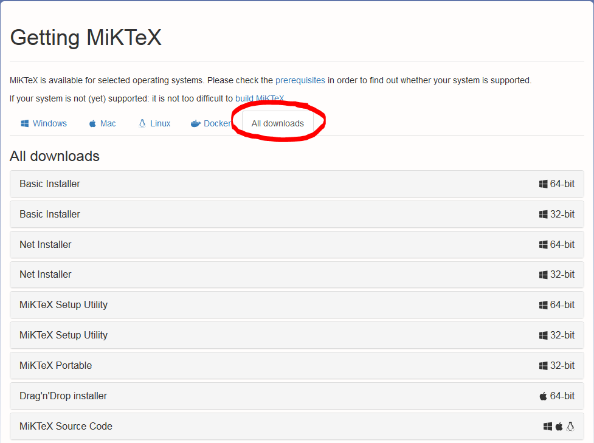{width=5in}
--->

```{r f02, echo=FALSE, fig.cap="Options for a Complete MiKTeX installation.", out.width = '50%', fig.align="center", out.extra='style="background-color: #ffffff; padding:10px; display: inline-block;"'}

```

Do **NOT** use the Basic installer version for Windows systems.  Instead, select from one of the two available Net Installers (Fig. \@ref(fig:f03)).  You can select a 32-- or 64--bit version.  If you use 64--bit R (most of us do) select the 64--bit Net installer and click **Download**.  

<!--
{width=5in}
--->

```{r f03, echo=FALSE, fig.cap="Select the 64-bit Net Installer for a Complete installation, **NOT** the Basic Installer. **NOTE** the Figure shows Version setup-2.9.6637-x64.exe.", out.width = '50%', fig.align="center", out.extra='style="background-color: #ffffff; padding:10px; display: inline-block;"'}
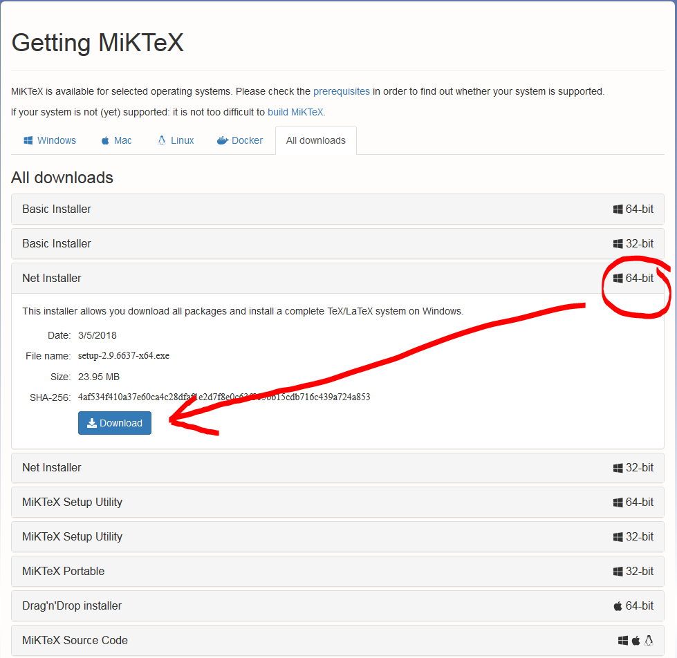
```

Save the `.exe` setup file to your default CPU Downloads location.  The MiKTeX setup version as of `r format(Sys.time(), '%d %B %Y')` is `setup-2.9.6942-x64.exe`.  Double--click to begin the GUI process.  Depending on your browser and site security constraints, you may be asked to verify acceptance before proceeding.  Begin by accepting the **Copying conditions for MiKTeX**.

### The Installation Process

The installation process involves two steps.  First is downloading the installation files onto your CPU.  The second is the installation of those files.  

#### Step #1: Download the Files

Look at Fig. \@ref(fig:f04) below.  First click on the **Download MiKTeX**.  

<!--
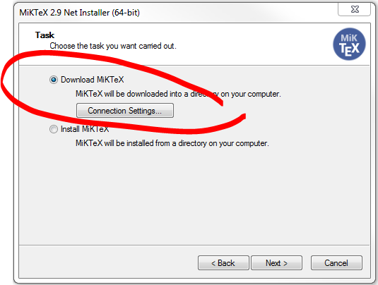{width=5in}
-->

```{r f04, echo=FALSE, fig.cap="Select the Download option followed by a download server from the list provided.", out.width = '55%', fig.align="center", out.extra='style="background-color: #ffffff; padding:10px; display: inline-block;"'}

```

When the Package Set GUI pops up, select the **Complete MiKTeX** (Fig. \@ref(fig:f05)).

<!--
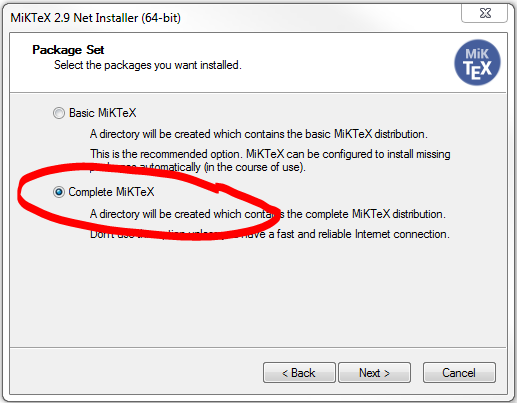{width=5in}
-->

```{r f05, echo=FALSE, fig.cap="Select the Complete MiKTeX.", out.width = '53%', fig.align="center", out.extra='style="background-color: #ffffff; padding:10px; display: inline-block;"'}

```

Next, select a download site from the options that are presented.  Be advised some of the sites can be touchy, and if you're downloading from a slow router you may encounter a "Connection Timeout."  If this happens, cancel, take a deep breath and select another download site.  The download files GUI will default to a location on your CPU.  You can change this if desired, but it's not really an important issue.  Remember, you are merely downloading files that will next be installed.  After installation you can delete the download files.  I recommend you stick with the default download location.

Now, find something else to do for a while.  As noted above, this example took 1.25 hr to download.

#### Step #2: Install the Download Files

After the download is completed, double--click the `setup-2.9.6942-x64.exe` again.  This begins the installation process.  As above, you will need to accept the copying conditions.  Once accepted, the Installer GUI will open again.  This time click `Install MiKTeX`, and in the next GUI pop--up click `Complete MiKTeX`.  A different GUI now appears, asking if you desire to install for just you (ie the USR), or a CPU--wide install.  

I recommend an install for you, the USR (Fig. \@ref(fig:f06)).  This creates an install similar to your user--specific R library you built when you first installed R.  This also pulls the install out of CPU administration (in Windows) and allows you to modify the underlying LaTeX packages (ie add new packages) just like you can add new packages to your R library.

<!--
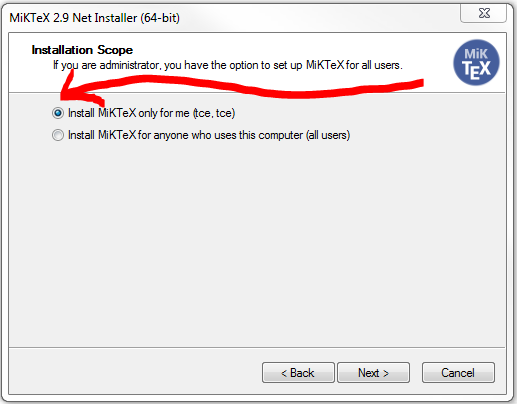{width=5in}
-->

```{r f06, echo=FALSE, fig.cap="Select the USR--specific installation option.", out.width = '53%', fig.align="center", out.extra='style="background-color: #ffffff; padding:10px; display: inline-block;"'}

```

The install will begin from the download location on your CPU; that is, where the files for the installation were downloaded during the **Download the Files** section above.

After clicking **Next** the installation directory will appear.  Note mine below (Fig. \@ref(fig:f07)) is USR--specific -- me, as USR `tce`.  Yours will look the same only your USR name will show rather than mine of `tce`.  Click next, and once again find something to do for a while.  The "clean" install being shown here took 0.5 hr.

<!--
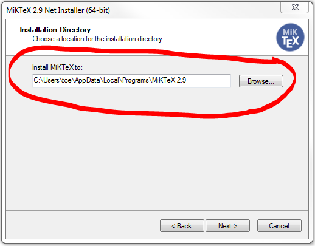{width=5in}
-->

```{r f07, echo=FALSE, fig.cap="Choose the default directory under your USR name.", out.width = '53%', fig.align="center", out.extra='style="background-color: #ffffff; padding:10px; display: inline-block;"'}

```

When it's done, you're read to build a PDF from RStudio!!

### Testing the Installation

The fastest way to test is to open RStudio, then click **File** => **New File** => **R Markdown**.  This merely opens the RMarkdown example file.  **Knit** all three options, HTML, WORD, and PDF.  All should now be working.

---

## Option #2:  Install TinyTeX

**TinyTeX** is an alternative to the full MiKTeX installation described above.  It will allow you to compile PDF documents from RMarkdown as well, only it uses a smaller subset of the available LaTeX commands.  It is derived from the distribution TeX Live.

It is being strongly promoted within the RStudio community as an alternative to a MiKTeX installation because it is simpler and faster to install.  Installation on the "clean" CPU took approximately 0.25 hr.

### How to Install

Installation of TinyTeX is straightforward.  You first will install the R package `tinytex`, and then use that to install the TinyTeX distribution.  Be careful of the differences in capitalization.  **tinytex**, all lower case, is the R package.  **TinyTeX**, with some capitalization, is the LaTeX--based distribution.

If RStudio is open, close it down and re--start.  Next, implement the code below.

```{r eval=F}
install.packages("tinytex")  # install the package tinytex
```

Your console (lower left panel) will show something similar to Fig. \@ref(fig:f08) below.

<!--

{width=5in}
-->

```{r f08, echo=FALSE, fig.cap="Choose the default directory under your USR name.", out.width = '65%', fig.align="center", out.extra='style="background-color: #ffffff; padding:10px; display: inline-block;"'}
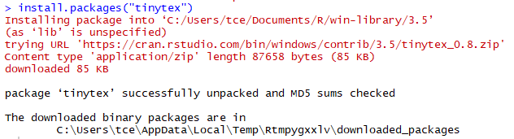
```

Next, install the TinyTeX LaTeX--based distribution.

```{r eval=F}
tinytex::install_tinytex()  # install TinyTeX
```

If a previous installation of MiKTeX is your system, you will get a console error like below (Fig. \@ref(fig:f09)).  If this appears, uninstall MiKTeX from your CPU and re--run the command.  You may have to re--boot your CPU after the uninstall.

<!--
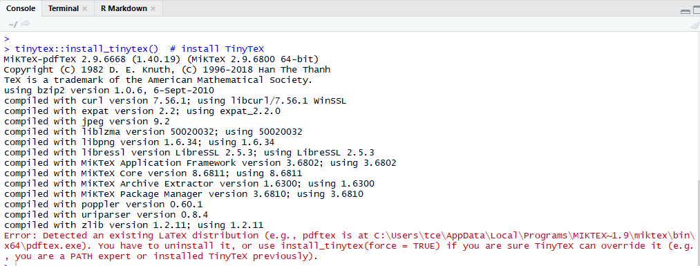{width=5in}
-->

```{r f09, echo=FALSE, fig.cap="Inidcation you have a previous MiKTeX installation that may interfere with TinyTeX.", out.width = '65%', fig.align="center", out.extra='style="background-color: #ffffff; padding:10px; display: inline-block;"'}

```

During installation of TinyTeX you will likely see the error below (Fig. \@ref(fig:f10)).  It can be ignored.  Just click "OK" ...

<!--
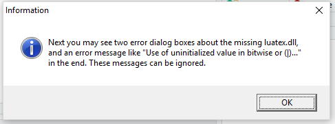{width=3.5in}
-->

```{r f10, echo=FALSE, fig.cap="Ignore this error; just click \"OK\".", out.width = '45%', fig.align="center", out.extra='style="background-color: #ffffff; padding:10px; display: inline-block;"'}

```

... and some more errors like (Fig. \@ref(fig:f11))...

<!--
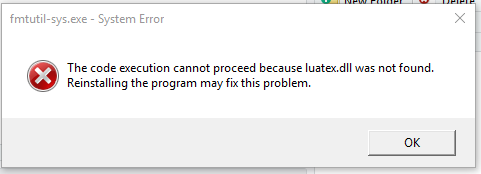{width=3.5in}
-->

```{r f11, echo=FALSE, fig.cap="More errors; just click \"OK\" again.", out.width = '45%', fig.align="center", out.extra='style="background-color: #ffffff; padding:10px; display: inline-block;"'}

```

... will show up.  Just keep clicking "OK".

No clue why the errors are there.  The [developer](https://yihui.name/) of TinyTeX says to [ignore these errors](https://yihui.name/tinytex/).

Installation took approximately 0.25 hr, so it's clearly faster than MiKTeX.  Once the installation is complete, close and re--open RStudio and run the code below.  

```{r eval=F}
tinytex:::is_tinytex()  # check if installation worked
```

It will return **TRUE** if the installation worked.

<!--
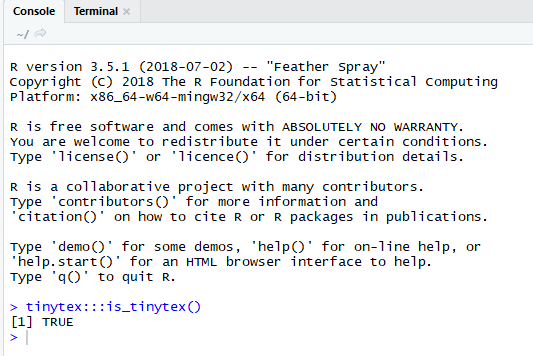{width=3.5in}
-->

```{r f12, echo=FALSE, fig.cap="Check if TinyTeX installation worked.", out.width = '45%', fig.align="center", out.extra='style="background-color: #ffffff; padding:10px; display: inline-block;"'}

```

### Testing the Installation

The fastest way to test is to open RStudio, then click **File** => **New File** => **R Markdown**.  This merely opens the RMarkdown example file.  **Knit** all three options, HTML, WORD, and PDF.  All should now be working.

You can now build PDF output!

