<!-- set root directory here --> 
```{r global_options, include=FALSE}
knitr::opts_knit$set(root.dir = "~/words/github/useR-master/vignettes")
knitr::opts_chunk$set(warning=FALSE, fig.align="center")
```

**Thomas C. Edwards**  
U.S. Geological Survey, Utah Cooperative Fish and Wildlife Research Unit, and  
Department of Wildland Ressources, Utah State University, Logan, UT 84322-5230 USA  

Last update: `r format(Sys.time(), '%d %B %Y')` (V2019.2)

---

# Purpose of this Vignette

This vignette describes how to build **R**Markdown documents and output in a variety of different formats.  In fact, this is a **R**Markdown document built within RStudio.

Expected outputs include **R**Markdown files containing proper syntax for constructing documents, and conversion of the syntax into HTML, PDF, and MS WORD formats.

---

# What is Markdown?

Markdown is a form of [document markup language](https://en.wikipedia.org/wiki/Markup_language).  A document markup language is a way to distinguish basic text from other document elements, such as those that occur during an editorial review.  For example, by clicking the "REVIEW" tab on a MS WORD document you initiate a "markup" process where a reviewer's comments and editorial suggestions are shown on the document. 

[Markdown](https://en.wikipedia.org/wiki/Markdown) still involves embedding additional elements into a document, but has a slightly different purpose.  It evolved as means to embed formatting syntax into a document and have it rapidly and easily converted to a desired format.  You "markdown" text, including, for example, document formatting such as boldface, headers, lists, and mathematical symbols and equations, pictures, links to other files or webpages -- in short, just about anything you see on a webpage, journal article, or book, can be constructed using Markdown.  Formats are fairly flexible, including output in HTML format for browsers or many different text formats.

In the case of R, and Markdown as an example of a document Markdown language, it provides a means to embed - and actually run -- R code from within a single document, all using simple syntax coding.  This is addition to the text formatting mentioned above.

Cool!  Right?

Think about this for a moment in your role as a scientist:  By using Markdown you can fully replicate the analytical processes that underlay your research, showing the code you employ, the output it generates, be it numeric or graphical, plus text explanations about the analytical processes of your work.  It can be, for all intent and purpose, your research metadata.

Although not a necessary requirement, it is easiest to configure and generate Markdown output from within [RStudio](https://www.rstudio.com/).  However, command--line code from [Plain Vanilla R](https://www.r-project.org/), which is still used by Curmudgeonly Dinosaurs like me, can also be used to generate Markdown documents.  From this point forward I'll call documents integrating R coding **R**Markdown documents so as to distinguish them from other types of Markdown documents.

---

## What Does the Output Look Like?

The most common outputs are HTML, MS WORD, PDF, or LaTeK.  **R**Markdown is quite powerful, and there exists an ever--expanding list of [customized Markdown templates](https://blog.rstudio.org/2016/03/21/r-markdown-custom-formats/) including, for example, a template for all journals published by Elsevier.  You can also build a [book](https://bookdown.org/yihui/bookdown/), a [webpage](http://rmarkdown.rstudio.com/rmarkdown_websites.html), or just about any form of [document](http://rmarkdown.rstudio.com/formats.html) you can imagine.

But you should probably start simple.  And that's what this vignette is all about.

---

## Why Should I Learn to Use It?

Hopefully some of the advantages as outlined above answer this question.  

But another, pragmatic reason relates to classes, especially mine.  Historically, I've accepted just about any format for answers to exercises, quizzes, and tests in courses I teach.  MS PowerPoint or WORD have been the most common.  However, I now require **R**Markdown as the means for evaluating coursework.

This is for two reasons.  A first reason is that as you begin your R programming adventures, you'll quickly learn that no "right" answer for implementing R code to meet an analysis objective exists.  You, as a student and researcher, will find a personal solution.  Other students and colleagues, one of them being perhaps more clever, might find a more efficient approach to a R coding issue.  Because one of the easiest ways for you to learn R is to see examples, **R**Markdown documents provide a great way for me to post -- and you to see -- "clever" answers to R coding problems.

The second reason is one of convenience for me as the instructor, and you as the student.  I get a consistent, easy--to--read and evaluate document that includes your R code, the results of that code, as well as the rationale for your R analytical pathway, and your interpretation of your results.  You, the student, get a fully documented process by which you performed an analysis for future reference, a metaphorical trail of breadcrumbs by which you can answer the time--honored question all analysts eventually face:  

"How the \*\*\*\* did I actually do ***that*** analysis??!!??"

---

# Get Started and Build a RMarkdown Document...

We're going to use features found in RStudio as the foundation for instruction in building **R**Markdown documents.  As we shall see, it has the advantage of some simple drop--downs for building, compiling, and editing the "code" used to build a **R**Markdown document.

Note, however, that all the **R**Markdown code as shown below will also work perfectly well in Plain Vanilla R.  So learn the **R**Markdown coding process and worry later about how to compile the document.

## A quick overview of the process from within RStudio

The steps below will help you build a simple **R**Markdown document.  There are many, many more options for creating **R**Markdown documents, but the best approach to learning **R**Markdown is to first learn how to build simple documents. You can then experiment with, and learn to apply, more sophisticated aspects of **R**Markdown to your documents.

**To build a Markdown document from within RStudio ....**

* Open RStudio
    * Create a new **R**Markdown file, __OR__ 
    * Open an existing **R**Markdown file
* Configure the document style using a YAML header
* Add some text, including formatting to:
    * Embed headers of different pitch (font size)
    * Apply boldface, italics to phrases and words
    * Use Blockquotes and lines as separators
* Embed and execute R code 
* Include some fancy document stuff ...
    * Links to external web locations
    * Embed pictures and videos
    * Include tables
    * Add mathematical symbols and equations
* Save and compile (i.e., "Knit") the **R**Markdown document

**NOTE** that although we're first learning how to build a **R**Markdown document from within the RStudio editor, all the text and associated **R**Markdown formatting could be entered into a basic text editor (e.g., [Notepad++](https://notepad-plus-plus.org/) for Windows 7/8/10 OS, [textmate](https://macromates.com/) for MAC Os), or even as a MS WORD document.  [**NOTE:** However, be careful using the latter; MS WORD carries special characters across depending on font (e.g., "" (quotes) in Times New Roman) that may not compile properly.]

---

## Create a New RMarkdown Document

Open RStudio.  You will first need to install the R package [`rmarkdown`](https://cran.r-project.org/web/packages/rmarkdown/index.html) and dependencies.  Note that your version of R must be $\geqq$ 3.0.  You should install the most current of RStudio as well, as it has recent features related to **R**Markdown.

From the upper left of the RStudio window

* Click __File__ =>
* Click __New File__ =>
* Click __R Markdown__ 

<!-- set pics directory here 
#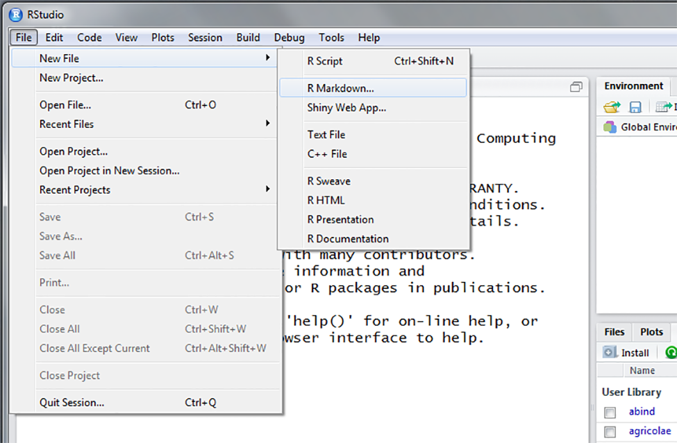
#
-->

<!-- set pics directory here 
NOTE;  out.extra not working in PDF / TeX output
```{r echo=FALSE, fig.cap="GUI dropdown for creating a new RMarkdown document", out.width = '50%', fig.align="center", out.extra='style="background-color: #ffffff; padding:10px; display: inline-block;"'}

```
-->

```{r f01, echo=FALSE, fig.cap="GUI dropdown for creating a new RMarkdown document.", out.width = '50%', fig.align="center"}

```

This will open a GUI dialog box (Fig. \@ref(fig:f01)) asking which of the three basic **R**Markdown documents types (i.e., HTML, PDF, MS WORD) you'd like to build.  It also shows dialog boxes for **Title** and **Author**.  For now, change the **Title** to ***Homework 1*** and **Author** to ***Your Name***.  Next, make sure the Document button on the upper left side is highlighted (blue color) and click on document type **HTML** (Fig. \@ref(fig:f02)).  This will open a default RStudio **R**Markdown document destined to be compiled in HTML format.  The **date** of the document defaults to the date when the document is first opened.

<!-- set pics directory here 
#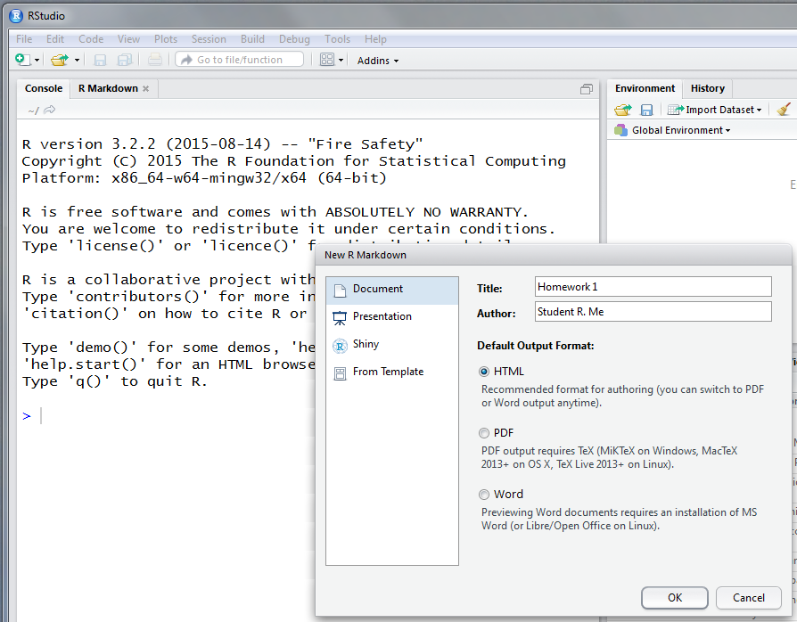
#
-->

```{r f02, echo=FALSE, fig.cap="GUI dropdown for selecting document style and setting a few parameters.", out.width = '50%', fig.align="center"}

```

For now ignore the text in the default document.  Merely highlight and delete the parts shown in blue (Fig. \@ref(fig:f03)), much as you would in MS WORD document.  

<!-- set pics directory here 


--> 

```{r f03, echo=FALSE, fig.cap="Be a cheater! Delete the verbiage highlighted in blue and save just the top five lines.", out.width = '50%', fig.align="center"}
knitr::include_graphics("figures/md03.png")
```

Once the deletion is done, 

* Click __File__ =>
* Click __Save As__ =>

and name the file something like **hmwk1.rmd**, where the **.rmd** file extension identifies the file as a R markdown document.

Close RStudio.  You've now created and saved a **R**Markdown template.

## Open an existing RMarkdown document

Pretty simple:

* Click __File__ =>
* Click __Open File__ =>

and navigate to directory and open the file.  Use the **hmwk1.rmd** we saved from above.  It will appear as:

<!-- set pics directory here 
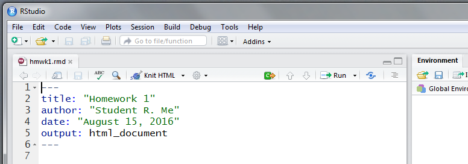

out.extra='style="background-color: #ffffff; padding:10px; display: inline-block;"'
--> 

```{r f04, echo=FALSE, fig.cap="The backbone of an HTML document.", out.width = '50%', fig.align="center"}

```

You now have the backbone template of a **R**Markdown document (Fig. \@ref(fig:f04)).

---

# The Building Blocks of a RMarkdown Document

## The Basic Structure - The YAML Header

All **R**Markdown documents begin with a **YAML header**, which originally meant "Yet Another Markup Language," but has since morphed to mean "YAML Ain't Markup Language."  The YAML header controls the format of the **R**Markdown document.  A basic YAML for a HTML document generated from within RStudio looks like the one found in our **hmwk1.rmd** file:

```
#### What a basic YAML looks like
---
title: "Homework 1"
author: "Student R. Me"
date: "August 15, 2019"
output: html_document
---
```

Of the four YAML elements shown above, only the **output:** is truly needed.  This YAML requests output be a **html_document**.  Some possible, but by no means all, **R**Markdown output types include:

* **output: pdf_document** (Adobe PDF)
* **output: word_document** (MS WORD)
* **output: beamer_presentation** (Adobe PDF slideshow)
* **output: ioslides_presentation** (HTML slideshow)

A more complete list of RMarkdown formats can be found [here](https://rmarkdown.rstudio.com/formats.html).

Other document control features, such as a CSS file that controls HTML output, or a MS WORD document template to control MS WORD output, can be added to the YAML.  More on that a bit later. 

## The Basic Structure -- The Text

```
####  Nothing special about adding text
This is text.  Just type away to your heart's content .... 

Use two hard returns to separate paragraphs (blocks) of text.
```

Click [here](markdown_basics01.html) [here](https://maddoor1.nr.usu.edu:45231/sharing/PTyR9X6nf) to see what the output looks like.  We'll learn more about how to configure text for bold, italics, and other text formatting features next.

## The Basic Structure -- Horizontal Line Separators

The most common use of horizontal separators is to distinguish among document sections.  You can add one, two, or any number of line separators.  Note a hard return and blank line is required after the first separator to generate two lines !!

```
#### Coding for line separators
The sequence of --- (three hyphens) adds a line separator to the document.

---

The sequence two sets of --- (three hyphens) separated by a blank line

---

---

adds two lines of separators.  
```

## The Basic Structure -- Text Headers

Headers can be up to 6 levels, with each level preceded by the number of `#` (pound or hashtag) symbols representing the header level.

```
#### Adding different levels of headers
# Header1
## Header2
### Header3
#### Header4
##### Header5
###### Header6
```

Examine the [output](https://maddoor1.nr.usu.edu:45231/sharing/gnYc1CSgD), showing both headers and line seprators.  Note that by the time you've reached **Header6** the font is quite small relative to the text.  You can create headers with greater than 6 `#`; however, at some point headers $>$ 6 revert to the base pitch.

## The Basic Structure -- Bold, Italics, Blockquotes, and Lines As Separators

Words and phrases can be emphasized using **Bold**, _Italics_, and _**Combinations**_ of each.  There's even a **Blockquote** option which allows for (pithy?) phrases or paragraphs to be highlighted.

```
#### Boldface and Italics
Encapsulate a word with ** (two asterik) or __ (two underscores) 
to **Bold** or __Bold__ text. 

For italics, use a * (single asterisk) or _ (single underscore) 
for *emphasis* or _emphasis_. 

Use a sequence of *** (three astrik) or ___ (three underscores) 
to create ***bolded, italicized words***. 

There should be no spaces betwen the first and last characters of the 
word or phrase to be bolded or italicized.

#### The Blockquote
Use the > (greater than) symbol to create a

> Blockquote of (typically pithy) text.
```

Our **R**Markdown [document so far](https://maddoor1.nr.usu.edu:45231/sharing/DWt5dEMMC) includes basic text, line separators and headers to distinguish among document sections, and boldface and italics.  There's even formatting to add blockquotes that highlight text sections.

Let's next add lists.

## The Basic Structure -- The List

Lists use the `*` (asterisk) or `+` (plus) or `-` (hyphen) for an unordered list; simply add a hard return and another `*` or `+` or `-` to create the second item in the list.  For indenting, use either a tab or at least four spaces.

A numbered list begins with the desired number, say 1, and followed with successive numbers.

Note that **R**Markdown has some limitations for classical numeric listing of 1, then 1.1, then 1.1.1, etc.  These are better controlled using a CSS template from within the YAML.

```
#### Unordered Lists
* Build an unordered Markdown list using the * (asterisk)
* Add a second list element
    * at least 4 spaces (or a tab) before the * results in indenting
    
#### Ordered Lists
1. Build an ordered Markdown list using numbers
2. Add a second list element
    1. at least 4 spaces (or a tab) before an ordered sub-list
```

Click [here](https://maddoor1.nr.usu.edu:45231/sharing/Emz20Obhu) to see what list output looks like.

## The Basic Structure -- Embedding R Code

Any R--based coding operations can be embedded into a **R**Markdown document and resultant output displayed.  This means if you've crazy complex R code you can run that code from a **R**Markdown document and create a report containing all code, its output, plus whatever King's English you wish to include. 

However, at this stage in learning how to use **R**Markdown, we'll keep the R coding simple  until we've learned how to build a basic **R**Markdown document.  More complex operations -- complete with fully formed examples -- are shown below.

Specifically, we will:

* Learn about the **chunk** for embedding code
* Embed and control execution of R code within a **R**Markdown document

### What is the **chunk** in a RMarkdown document?

**chunk** is the term that refers to R code to be rendered in a **R**Markdown document.  A **chunk** can include one or more lines of R code implemented as a block of code, or a **chunk** can be executed inline and directly from within text constituting a sentence.  **chunk**'s can be embedded directly by typing into the document, or by using the drop-down **chunk** icon on the toolbar. 

The basic block **chunk** begins with ` ```{r}` (three backticks ` ``` ` then `{r}` with no spacing), follows with a hard returns for each line of code in the block, and ends with ` ``` ` (three backticks).

An inline **chunk** of code begins with `` `r ``, follows with a single blank space, then the executable R code `Code2Execute`, and ends with `` ` ``.  

    #### The basic R Markdown chunk as a block of code 
    ```{r}`r ''`
    CODE TO EXECUTE GOES HERE
    ```
    #### The basic R Markdown chunk as inline, executed R code
    blah blah text `r`r ''` Code2Execute` more blah blah text

The default execution of a block **chunk** returns the R code plus results of the code, while an inline **chunk** returns a value and embeds it directly into a sentence.

### Setting local chunk options

Common options to modify output to the **R**Markdown document include: 

* Naming a **chunk**, which is useful when searching for errors;
* Return results but not the code; 
* Return the code, or some part of the code, but not the results; 
* Having all or some portion of the R code echoed back during execution.  

These options can be set locally within a **chunk**, or set globally for all **chunk**'s.  Within a **chunk** options appear inline within the `{r}` syntax.  Multiple options can be set, with each separated by a `,`.  Although RStudio shows some of the [available **chunk** options](http://rmarkdown.rstudio.com/authoring_rcodechunks.html), a more comprehensive discussion of possible **chunk** options is found within the [**knitr** homepage](http://yihui.name/knitr/options/).

    #### Naming a chunk
    ```{r ChunkName}`r ''`
    CODE TO EXECUTE GOES HERE
    ```
    #### Return the results but not the code
    ```{r echo=F}`r ''`
    CODE TO EXECUTE GOES HERE
    ````
    #### Return the results, and only lines 4:7 of the code
    ```{r echo=4:7}`r ''`
    CODE TO EXECUTE GOES HERE
    ```
    #### Return the code but do not evaluate
    ```{r eval=F}`r ''`
    CODE TO EXECUTE GOES HERE
    ```
    #### Naming a chunk, and supressing return of code
    ```{r ChunkName, echo=F}`r ''`
    CODE TO EXECUTE GOES HERE
    ```

### Setting global chunk options

Global options set **chunk** options throughout the entire document, such as the suppression of R messages and warnings.  Global options should be inserted after the YAML, and before the document text begins. 

Two common global options are shown below: the first suppresses (the sometimes truly obnoxious R) warnings and messages, while the second sets a global working directory for the **R**Markdown document.  **NOTE** that whatever `root.dir` is set to requires all subsequnet opertaions, e.g., access to data files to input, any output directories, be nested underneath that directory.  Access this small vignette on changing directories within a **R**Markdown document if you wish to learn more.

    #### Setting global options 
    ```{r global options}`r ''`
    knitr::opts_chunk$set(warning=FALSE, message=FALSE)
    knitr::opts_knit$set(root.dir = "~/MyRMarkdownDocumentDirectory")
    ```

Check out what an **R**Markdown document with code [looks like](https://maddoor1.nr.usu.edu:45231/sharing/3P3IJnJct).

---

# "**Knit**" the Basic Document

So far we've seen how to develop a basic **R**Markdown document.  However, we've not yet seen how to actually build the desired document type from the code.  So how is it done?

The process of converting the **R**Markdown text to the preferred document type (e.g., HTML, PDF, MS WORD) involves several steps.  The process first involves the function `render` from within package `rmarkdown`, which feeds the **.rmd** file (what we're now learning how to build) to package [`knitr`](https://cran.r-project.org/web/packages/knitr/index.html).  `knitr` creates a new markdown output **.md** which is converted to the desired document type using the function `pandoc` from package `knitr`.

Whew!  Probably too much detail, right?

Luckily, these steps have been condensed into a single dropdown command within RStudio.  The process is called **Knit**.

From within RStudio open the **hmwk1.rmd** template saved at the beginning.  For now it should only show the YAML.  Add some headers and text, some boldface and italics, a list, and even a blockquote if desired.  Something similar to that shown in Fig. \@ref(fig:f05) will work.

<!-- set pics directory here 
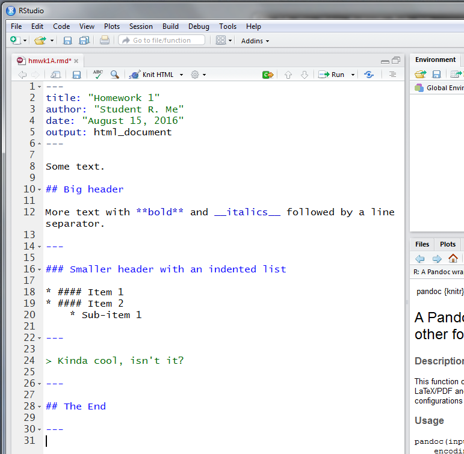

out.extra='style="background-color: #ffffff; padding:10px; display: inline-block;"'
--> 

```{r f05, echo=FALSE, fig.cap="Some simple text for a RMarkdown document.", out.width = '50%', fig.align="center"}

```

Once that is done, click the $\blacktriangledown$ (carrot) by **Knit** and select the type of document desired.  For now select **HTML** (Fig. \@ref(fig:f06)).

<!-- set pics directory here 
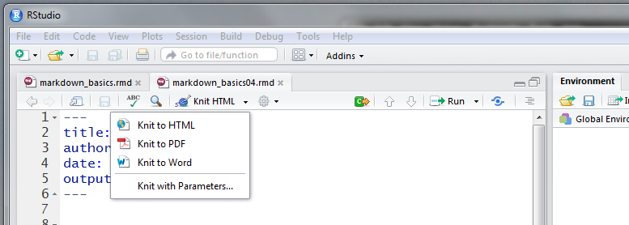

out.extra='style="background-color: #ffffff; padding:10px; display: inline-block;"'
--> 

```{r f06, echo=FALSE, fig.cap="GUI dropdown for \"kniting\" the document.", out.width = '50%', fig.align="center"}

```

The **R Markdown** panel (lower left of your RStudio panels) will scroll through output, and a new window will popup with the **knitted** document.  Assuming no errors (we'll deal with those in a while ...) you now have a completed HTML document that can be opened in any browser.  The HTML document will also be saved in your default working directory.

<!-- set pics directory here 
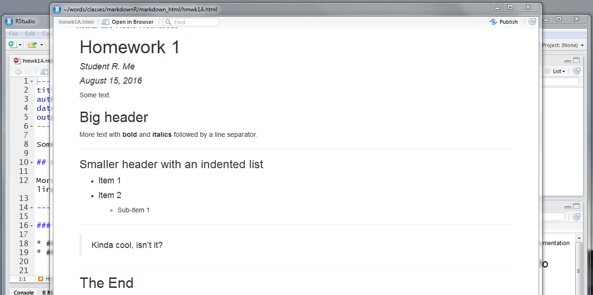

out.extra='style="background-color: #ffffff; padding:10px; display: inline-block;"'
--> 

```{r f07, echo=FALSE, fig.cap="A completed RMarkdown HTML document.", out.width = '50%', fig.align="center"}

```

You're done !!  You've built your first **R**Markdown document in HTML format (Fig. \@ref(fig:f07)).

---

# Getting Creative With Your Markdown Document

So far we've built a basic **R**Markdown document and exported it as a HTML format.  Next, let's consider some more creative aspects of **R**Markdown documents, including:

* Links to external websites and files;
* Incorporation of pictures and videos;
* Data and other informative tables; and
* Use of mathematical symbols and equations

## Links to external websites and files

Linking websites and existing files involves two coding symbologies: the `[]` (two square brackets) followed immediately by `()` (left right parentheses) as in `[]()`.  Do **not** place a blank space between the `[]` and `()` symbol sets.  Content inside the `[]` becomes the highlighted text for the link, while text inside the `()` is the actual http:// or https:// website location.

```
#### Coding a link to a website
[LinkText](WebAddress)

You can make links explicit, as in "Click [here](https://www.rstudio.com/) to access RStudio."  
[here] becomes the highlighted link to click. 
The actual link, enclosed by the (), is not visible in the RMarkdown document.

Or, you can highlight entire phrases, such as 
"The [R-project homepage](https://www.r-project.org/) is the starting location to learn about R."
In this example, the [R-project homepage] phrase is the highlighted link to click.
```

Files can be a bit trickier, mostly because of file pathnames.  For now, we'll assume everything is nested under your OS home directory.

```
#### Coding to link to a file
This is how to link a file, such as a file called [MyPDF](NameOfFile.pdf).
```

Let's see what links look like in a [finalized Markdown document](https://maddoor1.nr.usu.edu:45231/sharing/l3QRGgWpq) displayed in a browser.

## Links to external pictures and video

Coding for pictures and video is not too different from that for files, subject only only to some file--type constraints.  Although work--arounds do exist, pictures embedded in **R**Markdown should be bitmap-- rather than vector--based.  Common bitmap image formats include **.png**, **.jpg**, **.gif**, **.tif**, and **.bmp**.  In general, **.png** are considered excellent for web-based output (small file size, no loss in quality), although **.jpg** can do better for photographs, especially those rich in color.  **.tif** formats are equally good for rich colors, but suffer from large file size.

You can convert among the many different image formats using an image editor.  Some great freeware image editors include [IrfanView](http://www.irfanview.com/), [InkScape](https://inkscape.org/en/), [ImageMagick](http://imagemagick.org/script/index.php), or [GIMP](http://www.gimp.org/). 

### Embedding a picture

Code to embed a picture can be of one of three types, a **R**Markdown-based linkage, a [HTML--based](http://www.w3schools.com/tags/tag_img.asp) linkage, or from within a **chunk** using [`knitr`](https://cran.r-project.org/web/packages/knitr/index.html).  

Two cautionary notes:

* When adjusting picture size based on pixels, make sure you re--scale both the width and height simultaneously.
* It is common courtesy, as well as a potentially legal requirement, to reference any picture(s) "borrowed" from the web.

#### The RMarkdown version 

Coding for insertion of a picture is below.  The `!` indicates an image, the `[]` can be used for a caption or reference for the picture, and the `()` the picture filename. **NOTE** that although a picture caption can be added, it is not required.

```
#### RMarkdown coding with a picture caption


#### RMarkdown coding without a picture caption

```

#### The HTML version 

The HTML version merely uses the HTML `` code.  If you wish to control the number of pixels presented (i.e., make the picture bigger or smaller) then use HTML coding.  Alternatively, use one of the image editors noted above and create the desired picture size in pixels, and then use the **R**Markdown linkage.

Results using HTML coding will be the same as Markdown coding.  Note that any caption -- here, the source of the picture -- must be added as a line of text below the picture.  You can control the size of the picture using `height=` and `width=` options in the `` tag.  Options for the HTML `` tag can be found [here](http://www.w3schools.com/tags/tag_img.asp).

```
#### HTML coding with defult size (pixels) of picture

 

Source: http://mikemclin.net/markdown-syntax-language/ 

#### HTML coding with specified width and height in pixels
 

Source: http://mikemclin.net/markdown-syntax-language/
```

#### The `knitr` option

Use of `knitr` to embed provides more control over picture characteristics.  It also provides more flexibility to move among different document formats, such as **LaTeX**.  The picture is called from within the **chunk** using `knitr::include_graphics("PictureFilename.Type")`.  Here, we use the **chunk** to add a caption (`fig.cap=""`), control the size of the picture using `out.width=""`, and make the picture centered using `fig.align="center"`. 

`out.extra=''` allows for CSS control of a picture using `style="CSS formating here"`.  One nice trick is to "pad" a picture with a small white (or any color) border based on pixels, i.e. `padding:10px` in this example.  This elimintaes the "squished" look of HTML's where pictures appear too close to the text above and below.  **NOTE** that while `out.extra=` works fine in HTML formats, it does not always render correctly in PDF documents.

    #### knitr coding with 
    ```{r echo=FALSE, fig.cap="Source: http://mikemclin.net/markdown-syntax-language/", out.width = '50%', fig.align="center", out.extra='style="background-color: #ffffff; padding:10px; display: inline-block;"'}`r ''`
    knitr::include_graphics("figures/markdown_image1.png")
    ```

Check out the [updated homwork](https://maddoor1.nr.usu.edu:45231/sharing/3kasBhbb0) file with embedded pictures!

### Embedding video

Video within Markdown is restricted as of now to [YouTube](https://www.youtube.com/) only. This will undoubtedly change over time (for example see: package [`vembedr`](https://cran.r-project.org/web/packages/vembedr/vignettes/services.html)).  You will need to establish a **YouTube** account, and upload video into your personal **My Channel**. After uploading to **My Channel** you will receive the video's unique identifier.

**NOTE**, however, that if you have recorded video served from elsewhere, you can simply attach a link that opens the video in your browser, much in the same way access a picture.  The code below embeds a picture (often a screen--shot of the first frame of a video) that when "clicked" opens the video in your browser.  This is perhaps the simplest approach to linking video to a **R**Markdown document.

```
#### RMarkdown code for a left--justified clickable image that links to a video 
####   width= set to X%
[{width=X%}](https://VideoLink)

#### To center the video use HTML tag <div>
#### CAUTION: Must have line breaks (hard returns) before and after link
<div style="text-align:center">

[{width=X%}](https://VideoLink)

</div>
```

<!--
option 1

<center>

{width=50%}

[Click on picture for video](https://fws.rev.vbrick.com/#/videos/1c9e0ee4-132a-4c89-85a0-ed9565be9a91)

</center>

Option 2
<div style="text-align:center">

[{width=50%}](https://fws.rev.vbrick.com/#/videos/1c9e0ee4-132a-4c89-85a0-ed9565be9a91 "Just for Laughs")

</div>
-->

See this [excellent blog by Sergei Sviridov](http://sviridovserg.com/2017/05/22/embed-youtube-to-markdown/) for more details.

## Data and Other Informative Tables

Construction of data and text tables in **R**Markdown can be frustrating and irritating, as well as visually unappealing when output, principally because **R**Markdown does not actually support tables *per se*.  All forms of table construction allow for inclusion of a table description.  By default they extend across the entire webpage width when in HTML format.

Several variations of types of tables exist.  The examples here are for simple tables only; additional methods for constructing tables based on R packages will be illustrated below when we begin to embed code into **R**Markdown documents. Note also that the table output from even the simple code show below will change if different CSS output control files are attached to the **R**Markdown document.

We will explore the different options for table constricton below, and examone ouptut from each at the end of this section.

---

### The Pipe Table

The simplest table code to implement is the so--called **pipe** table.  The term **pipe** refers to the `|` (vertical bar) symbol, which is used to separate among cells and the information each cell contains.  It requires column headers, either as text or blank, separators based on `--` (hyphens) between the header and the cells, and as noted above, the `|` (vertical bar) pipe symbol.  Default is left alignment; the `:` (colon) is used to change alignment as shown below.  A hard return, followed by a `:` (colon) symbol and text creates a table description.  The description defaults to above the table information when the table is output.

```
#### Coding a simple pipe table.
| Default | Left | Right | Center |
|---------|:-----|------:|:------:|
|     12  |  34  |  56   |    78  |
|    901  |  234 |  567  |   890  |
|      1  |    2 |    3  |     4  |

: Table 1.  Demonstration of pipe table syntax.
```


There's [a reasonably friendly website](http://www.tablesgenerator.com/markdown_tables) for building pipe tables, too.  It handles .csv files as well.

You can "force" pipe tables to wrap text by altering the relative widths of the first (header), second (demarcation), and third through *n* (table information) rows.  In the example below the width of text plus space in the header (1st) row in Column 1 of the table is identical to the width of the demarcation (2nd) row.  In Column 2, the width of the 2nd row is greater than the header width **and** the text in the table information row is greater as well.  This forces a wrap--around.

```
#### Coding a pipe table with wrap-around.
| Column 1 | Column 2 | Column 3 | Column 4 |
|:---------|:-----------|:-----------|:----------|
| Some | This is an exceedingly verbose sentence that should wrap around  | It wraps around | The |
| column 1 | in | because the pipe length in the 2nd row  | last column |
| text | Column 2 | is greater than the pipe length in the 1st row. | is 4 |
```

### The line table

An alternative is the **line** table.  Here, the top row (blue color in RStudio) in the table consists of multiple `-`'s (hyphen) in a row.  The second, header row consists of the column names.  The third row (red color in RStudio), also a sequence of `-`'s, sets the widths of the columns, and determines column alignment based on the location of the column names relative to width of the `-`'s.  Default alignment is left.  To control left alignment, the column header aligns on the left of the `-`'s; right aligns with the right side of the `-` sequence.  Centering occurs when there is an extra `-` on either side of the column name.

Unlike a **pipe** table, absolute width in a **line** table can be controlled by the combined length of the third row of `-`'s.  In the first example, the table is a "minimal width" table where just enough third row `-`'s are added to control column alignment.  The second has a longer sequence of `-`.  This will expand the column width.

```
#### Line table of minimal width
-----------------------------
Default Left   Right  Center
------- ----- ------ --------
12      34      56   78 

901     234    567   890 

1       2        3   4
----------------------------

#### Line table of expanded width in column 4
-----------------------------
Default Left   Right  Center
------- ----- ------ ---------------------
12      34      56   78 

901     234    567   890 

1       2        3   4
----------------------------
```

Compare the [different table configurations](https://maddoor1.nr.usu.edu:45231/sharing/mGwgPPugn) arising from the **pipe** and **line** table coding.  In particular, note the wrap-around text in the **pipe** table, and the expansion of column 4 width in the **line** table.  Realistically, I've never been able to get a **R**Markdown table "correct" in the first try, let alone the first several tries.  It often requires playing around with different width configurations until you obtain output that is visually appealing.

## Embedding Mathematical Symbols and Equations

One of the more powerful aspects of **R**Markdown is the ability to use mathematical symbols and build (even complex) mathematical equations, and have those portrayed in the final **R**Markdown document.  Mathematical symbols and equations in **R**Markdown use TeX math, which although it relies on LaTeX syntax for the symbol or equation, is a bit different in implementation.  

The difference is that Tex math uses the `$` (dollar sign) symbol to start and stop various mathematical symbols used in isolation or as part of an equation while LaTeX uses the `\` (left slash) only.  The implementation difference is that the `\` (left slash) symbol is an escape character in **R**Markdown.  Within **R**Markdown, the first `$` must be followed by a character (not a blank space), while the last `$` requires a character on its left.  The closing `$` **cannot** be followed by a digit.  

Consider the following examples: 

* Sample $\bar{x}$ temperature ($\pm$ 2-SD) was 11.8 (2.3) $^\circ$C
* Pythagorean's theorem is $x^2 + y^2 = z^2$
* The simple linear regression equation is: $Y_i = \beta_0 + \beta_1 X_i + \epsilon_i$

They represent in--line embedding of symbols and equations.  

```
#### LaTex coding for the in-line examples above
* Sample $\bar{x}$ temperature ($\pm$ 2-SD) was 11.8 (2.3) $^\circ$C
* Pythagorean's theorem is $x^n + y^n = z^n$
* The simple linear regression equation is: $Y_i = \beta_0 + \beta_1 X_i + \epsilon_i$
``` 

More complex equations, designed to be represented as stand--alone lines in a document, can also be constructed, as with the sample variance example shown next.

The equation for sample variance is: 
$$s^2 = \sqrt\frac{\sum\limits_{i=1}^{n}(x_i - \bar{x})^2} {n - 1}$$ 

In this example, the equation is centered rather than left--aligned.  This was accomplished using two `$$` (dollar sign) symbols at the beginning and end of the equation rather than one `$`.

```
#### LaTex coding for a centered, stand-alone equation 
The equation for sample variance is: 
$$s^2 = \sqrt\frac{\sum\limits_{i=1}^{n}(x_i - \bar{x})^2} {n - 1}$$ 
```

The code to embed mathematical symbols and build equations relies on LaTex syntax.  One of the better websites for LaTex coding syntax is the [AoPS (Art of Problem Solving) Wiki](https://www.artofproblemsolving.com/wiki/index.php/LaTeX:Symbols), while a convenient two-page "cheatsheet" built by Winston Chang and licensed by [Creative Commons](https://creativecommons.org/licenses/by-nc-sa/3.0/) can be accessed from [here](https://wch.github.io/latexsheet/).

---

# Embedding and Implementing R Code into a RMarkdown Document

In the first part we learned how add R code -- the **chunk** -- to a **R**Markdown document.  Now we'll see some examples of how to embed R code into the document, and control the execution and output of the code depending on the desired final **R**Markdown document.

## EXAMPLE \#1: Embedding and Executing R Code

Let's execute R code embedded in a **R**Markdown document.  For an example we will use a small cross--classified data structure examining fish selection by males and females of the piscivorous osprey ***Pandion haliaetus***.  Three types of fish -- bass, shad, and sunfish -- were available.  A simple contingency analysis will be applied to the data.

This first **chunk** example imports a `.csv` file and examines the resulting dataframe structure.  Note that output lines are preceded with `##` (two pound symbols); this helps distinguish code from output.  All **chunk**'s in this example accept the default and return both the R code being evaluated and the output.  This is so you can understand the **chunk** rendering process in **R**Markdown.

```{r}
# import data and examine dataframe characteristics
  f1 <- read.csv("data/ospreypreybysex.csv", header = T)
  str(f1)  # examine dataframe structure
```

Next, examine the cross--classified table of fish species captured by each sex.  

```{r}
# cross-tabluation of captures by fish spp and osprey sex
  f2 <- xtabs(count ~ ospreysex + fishspp, data = f1)  # cross-tab the data
  f2  # cross-tab output
```

Last, apply the $\chi^2$ test to the data, write the output to the object `f3`, and see what output parameters are available from `f3`.  We'll explain why we did this in Example \#2.

```{r}
# chi-sq test of cross-tab data
  f3 <- chisq.test(f2)  # chisq test
  f3  # chi-sq output
  ls(f3)  # available output parameters from the chi-sq analysis
```

**NOTE** that all three **chunks** include comments explaining the code actions.  

---

## EXAMPLE \#2:  Converting the Analysis to King's English

If this were a classroom exercise, I -- an instructor -- would most likely wish to see all the code and output as shown in Example \#1.  That way I could evaluate your work and grade the exercise.

However, consider other circumstances where you wish to render the various **chunk** outputs into a sentence (or paragraph) of plain Ol' King's English.  That sentence might be something like:

> A $\chi^2$ analysis indicates that male and female ospreys differentially selected fish species while foraging ($\chi^2$ = `r round(f3$statistic, 3)`, *p* = `r round(f3$p.value, 3)`, *df* = `r f3$parameter`).

Wow!  

The analytical "answers" were (somehow) directly incorporated into the sentence.  How was the coding that resulted in that sentence written?  

First, examine the output of the $\chi^2$ analysis from above.  **NOTE** the sentence has captured the output $\chi^2$ statistic, the degrees of freedom (*df*), and the *p*--value, and incorporated those values directly into the sentence using inline **chunk** code.  The code that generated the sentence looks like this:

    #### chunk code as inline
    A $\chi^2$ analysis indicates that male and female ospreys differentially selected fish 
    species while foraging ($\chi^2$ = `r`r ''` round(f3$statistic, 3)`, 
    *p* = `r`r ''` round(f3$p.value, 3)`, *df* = `r`r ''` f3$parameter`).

We first embedded mathematical syntax to print the symbology $\chi^2$.  Next notice how inline **chunk** coding was used three times to extract specified information from the output of the $\chi^2$ analysis, the object `f3` we created earlier.  The `ls(f3)` call had returned the output objects of the analysis, of which `statistic`, `p.value`, and `parameter` represent, respectively, the values of the $\chi^2$, *p*-value, and *df*'s.  (**NOTE**: Selection of correct output objects by name assumes working knowledge of R analysis and outputs.)  These values were extracted using standard R coding, such as `f3$statistic`.  We also applied the `round()` function to the extracted values to reduce the number of significant digits carried over into the sentence.  

There is nothing fancy here:  these are basic R operations for extracting information from an analysis.  We've merely used **R**Markdown syntax to extract these values and embed them into a document.

Just imagine how useful this could be when writing reports !! (And your homework ...)

---

## EXAMPLE \#3:  Extracting and Presenting Tabular Information

A repeat of something stated above regarding tables in **R**Markdown:  

> "*Construction of data and text tables in **R**Markdown can be frustrating and irritating, as well as visually unappealing when output, principally because **R**Markdown does not actually support tables **per se**.*" 

Solutions do exist, but before we can produce more visually appealing tables in **R**Markdown, some basic understanding of format control in a **R**Markdown document is needed.  

Control of **R**Markdown output -- and tables the document contains -- can occur at two separate levels.  The first is default **R**Markdown syntax that controls the final rendering of the document.  Thus far we've only implemented HTML output, as specified in the YAML.  Consequently, output is converted to table coding conventions associated with HTML.  It is a minimalist approach.

A second approach is to control output of the entire **R**Markdown document by using [CSS control](http://www.w3schools.com/css/css_intro.asp).  Use of CSS control for **R**Markdown output is discussed in detail below under Advanced **R**Markdown topics, so it won't be discussed here.  Instead we'll focus on ways to apply some R packages to create tables.  

(**Full Disclosure:** I've been cheating thus far; this document has CSS control, while the output you've clicked on and followed is **R**Markdown default `HTML` without any CSS control.)

### Use of R packages for table control

There are several packages in R that provide control over table construction.  These include the function `kable` within package [`knitr`](https://cran.r-project.org/web/packages/knitr/index.html), and the packages [`pander`](https://cran.r-project.org/web/packages/pander/index.html) and [`xtable`](https://cran.r-project.org/web/packages/xtable/index.html).  Here we'll explore how these packages improve how tables looks visually, as well as how these packages and their functions can directly work with basic R code to generate tables.

We will use the osprey data set (`f1`) from above.  The data in the R dataframe look like this:

```{r echo=F}
# examine dataframe f1
  f1
```

### Build a Table Using the `kable` Function from Package `knitr`

Assuming your data are in a standard R dataframe, one method to build a table is to load the library `knitr` and apply the function `kable` to the data frame, here `f1`.  Important options to consider including are `col.names=`, where more "readable" labels can be used as table column headers, `digits=`, which applies a specified rounding to table output, and a vector of data alignment using `align=`. The `caption=` option allows for inclusion of a table description.

    #### build a table using fxn kable from package knitr
    ```{r}`r ''`
      library(knitr)  # load library: knitr
      kable(f1, col.names = c("Sex", "Fish Species", "Frequency"), align = c("l", "c", "r"),
       caption = "Fish capture freqeuncy by osprey sex")
    ```

The output `kable` table from the code above [looks like this](https://maddoor1.nr.usu.edu:45231/sharing/EnHiSS0KH).  As mentioned above, this form of table construction in a HTML environmment spans the entire width of the browser page.

### Build a Table Using the Package `xtable`

`xtable` has many of the same output options as the `kable` function, but also allows for more control of table output.  A necessary option to include within the **chunk** for a `xtable` is `results="asis"`, which renders the results into text.  Otherwise `xtable` [returns the code](https://maddoor1.nr.usu.edu:45231/sharing/HnRYDbeL6) for HTML, or other formats such as LaTex.  

Consequently modify the **chunk** as:

    #### chunk code to portray the rendered table
    ```{r, results="asis"}`r ''`
    ````

`xtable` also requires a `print()` wrapper or the default output is returned as LaTex code rather than text.  The option `type=` specifies the form of the output, as in HTML.  As with `kable`, some available formatting options include digits, alignments, and captions.  Row numbers are printed by default; use `include.rownames = F` to turn them off.

    #### build a table using xtable
    ```{r, results="asis"}`r ''`
      library(xtable)
    # xtable(f1)  NOT RUN: would return a default table of LaTex code
      print(xtable(f1), type="html", include.rownames = F)  # rendered table in html format
    ```
 
**NOTE** that [basic `xtable` output](https://maddoor1.nr.usu.edu:45231/sharing/KseBcOj8j)  includes `|` (vertical bar) as a separator between table cells, and that the data seem "squished" in appearance.  This appearance, as well as many other aspects of table appearance, can be controlled from within `xtable`.  The [xtable Gallery](https://cran.r-project.org/web/packages/xtable/vignettes/xtableGallery.pdf) is an excellent PDF vignette full of examples on how to format tables.

Assume you wish to change the sequential cell alignment to left, center, right.  This is the option `align=` where `r`, `l`, and `c` represent right, left, and center, respectively.  Assign the desired option with the initial `xtable` call and save it as an object (here, `tab1`).  The apply the `print()` wrapper to the object.  An oddity to note:  `xtable` automatically includes row numbers and you must format for that column, even if your intention is to suppress row numbers the final rendering of the text with `print()`.

Adding "readable" column names can be done within `xtable`, but it can be ponderous.  Because output from `xtable` inherits the original dataframe, it is easier to apply `names()` to the `xtable` object prior to rendering using `print()`.

One consideration regarding formatting in `xtable`.  Above, the `print()` wrapper was placed outside the `xtable()` call and all table syntax rendered in a single line of code.  For reason(s) I cannot fully figure out, format control seemingly works best if applied and saved as an `xtable` object, and then having the object rendered from inside the `print()` wrapper.  Attempting all formatting operations within a single call often fails.

    #### a xtable with alignment, new column names, and suppressed row names
    ```{r, results="asis"}`r ''`
    # add format:  alignment
      library(xtable)
    # xtable(f1)  NOT RUN: would return a default table of LaTex code
      tab1 <- xtable(f1, align = "llrc")  # formatting outside print() wrapper
      names(tab1) <- c("Sex", "Fish Species", "Frequency")  # rename columns
      print(tab1, type="html", include.rownames = F)  # rendered table in html format
    ```

[Compare the two outputs](https://maddoor1.nr.usu.edu:45231/sharing/3tyzaFNSV) -- one without `results="asis"` and the other with some minimal formatting.

### Build a Table Using the Package `pander`

Package `pander` is another means of formatting tables for output.  An added benefit of`pander` (as well as `xtable`, actually) is that it can access results of a statistical analysis and print a table of those results.  

As with `xtable`, it is simply easier to create "readable" column names outside the `pander()` call; here, the variables were renamed before the rendering.  `justify=` controls alignment, and a `caption=` can be added if desired.   A large variety of other [pander options](https://rdrr.io/cran/pander/man/pandoc.table.return.html) are available as well.

    #### built a table using pander
    ```{r}`r ''`
      library(pander)
      names(f1)=c("Sex", "Fish Species", "Frequency")  # rename columns
      pander(f1, caption = "Fish capture frequency by osprey sex", 
       justify = c("right", "center", "center"))  # rendered table in html format
    ```

Recall from above we accessed the results of the $\chi^2$ analysis (object `f3`) on osprey foraging, and used inline **chunk** code to present the results as text.  Assume instead you wish for a table of those results.  Simply call the saved analytical object, here `f3`, from inside `pander()`.  Note you can even embed mathematical symbols in the caption.

    #### render statistical output as a table: chi-sq test from above
    ```{r}`r ''`
      library(pander)
      pander(f3, caption = "$\\chi^2$ test of fish capture frequency by osprey sex")
    ```

You can see the `pander` table outputs [here](https://maddoor1.nr.usu.edu:45231/sharing/wjZ0kzOwT).

A (mostly complete) list of statistical analyses that `pander` can render as tables is found by loading the `pander` library and invoking `methods(pander)`.  Current offerings include:  

```{r echo=F}
# r analytical functions amenable to pander tables
  library(pander)
  methods(pander)  # returns available methods for pander
```

`pander` covers the bulk of traditional statistical analyses, but quoting directly from the [pander: An R Pandoc Writer](http://rapporter.github.io/pander/) site:

> *"If you think that pander lacks support for any other R class(es), please feel free to [open a ticket](https://github.com/Rapporter/pander/pulls) suggesting a new feature or [submit a pull request](https://github.com/Rapporter/pander/issues) and we will be happy to extend the package."*

In short, the site is open to suggestions for additional forms of statistical analysis to be rendered with `pander`.  In addition, you could create your own function if desired by emulating one of the other functions -- that's where some of the true power of R comes into play!

---

## EXAMPLE \#4: Constructing Figures in a RMarkdown Document

Embedding a R--generated figure or plot still uses **chunk** code, but with different options for configuration.  Beginning simple, consider a barplot of the frequencies of the three groups of fish captured by male and female ospreys and represented in our previous data object `f1`.  Note there are no **chunk** options; just the R code for a barplot is embedded in the **chunk**.  Default figure placement is left justification. 

    #### basic chunk code for embedding a figure
    ```{r}`r ''`
    # embed a plot
      PLOT CODE HERE ....
    ```
Here's some example code ...

    #### basic barplot inserted as figure in RMarkdown document
    ```{r}`r ''`
    # embed a barplot; assumes object f1 & f2 from above
      freq.r <- range(0, signif(max(f1$count), 1) + 10)  # use raw data for ylim= range
      bplot1 <- barplot(f2, ylim = freq.r, xlab = "Fish Species", 
       ylab = "Capture Frequency (n)", space = c(0, 0.5), col = c("black", "grey"), beside = T)
      abline(h = 0)  # add line to bottom of plot
      
    # add legend
      legend("topleft", c("Female", "Male"), fill = c("black", "grey"), bty = "n", cex = 1.25)
      title(main = "Fish Species Capture Frequency by Osprey Sex")
      text(x = bplot1, y = c(f2[1:6]), labels = c(f2[1:6]), pos = 3)  # adds f2 counts above bars
    ```

... and a resultant [barplot of the osprey fish captures by males and females](https://maddoor1.nr.usu.edu:45231/sharing/VhYjDf5oE) introduced above.

### Some Options for RMarkdown figures

Two common figure **chunk** options are to specify figure width and height, and create an outfile version of the figure.  Default figure size reflects R conventions; 480 $\times$ 480 pixels at 72dpi for bitmap-based output (i.e., **.png**), which translates into an approximate 6.7 $\times$ 6.7 inch size.  The option `fig.path="PATH/"`, where `PATH` followed by a `/` (right slash) indicates the directory for the figure.  

**IMPORTANT**: The specified directory path is from the default directory for the **R**Markdown document.  Otherwise a full path must be represented.

    #### set fig size as 4X4 & establish file outfile path
    ```{r, fig.width=4, fig.height=4, fig.path="outfigs/"}`r ''`
    ```

It may be beneficial to simultaneously plot a vector-based plot (i.e., **.pdf**, **.eps**) for archiving along with a bitmap-based (i.e., **.png**) plot for the document.  Simply suppress the R code and output using the **chunk** option `include=F`, and outfile the figure to the desired directory.

    #### suppress all output, & build PDF figure for output
    ```{r, include=F, fig.width=4, fig.height=4}`r ''`
    # create a duplicate of figure in pdf outfile
      pdf("PATH4FILE/FIGURENAME.pdf") 
    # plot code would follow here
      CODE CODE CODE ....
      dev.off()
    ```
    
**NOTE** there exists potential to alter figure placement by using the option `align="center"`, which uses HTML tag `` rather than the **R**Markdown `` syntax.  However, alignment other than left justified is not supported within HTML5, so it is best to not use alignments other than the default in HTML documents.  See the CSS HTML site for details on `` [tag control](http://www.w3schools.com/tags/tag_img.asp).

Be careful with sizing as it sometimes clips figure output unless the width:height ratio is considered.  This, however, is the same issue faced with any plot in R.  If you wish global control over figure characteristics, such as a desire for all figures to be of same width and height, or a common outfile directory, these can be inserted as options under the `{r global_options}`, much as shown for **warnings** above.

Last, do not forget it is R coding that determines characteristics of your **R**Markdown figure.  This means any type of plot that is possible in R can be embedded into your document.  [Check out results](https://maddoor1.nr.usu.edu:45231/sharing/OLpY3nL8p) of the options for figures we discussed here.

The [`knitr` website](http://yihui.name/knitr/) lists all available **chunk** [options for plots and figures](http://yihui.name/knitr/options/), including figure control for documents other than HTML output. 

---

# A Finalized RMarkdown HTML Document

Assume you have been instructed to complete a formal analysis and write-up of prey capture by male and female osprey using the data from above.  The write-up would include a list of objectives, the R code used for analysis, the output, and some measure of interpretation.  

One possible rendition of this homework assignment is [here](https://maddoor1.nr.usu.edu:45231/sharing/cJ2gXlNlH).

You're done!  You should now be able build a **R**Markdown document that integrates R coding and analysis directly into a HTML document.

---

# Additional Topics for RMarkdown Documents

As noted at the start of this document, there's almost unlimited potential for **R**Markdown-based documents.  If you made it through the first section of this document, you can easily create a HTML document.  And if you're in one of my classes, a **R**Markdown document is how I'll be expecting your homework to be delivered to me.  So experiment with different ways to document your work; that's the best way to learn **R**Markdown syntax.

Even with an almost unlimited potential, there are several advanced topics for **R**Markdown to be considered.  These include, in no particular order:

* Minor syntax issues to make your **R**Markdown life easier
* Use of CSS to control HTML document formatting
* Outputting in other document formats

## Minor syntax issues to make your **R**Markdown life easier

### Setting a working directory other than default 

**R**Markdown defaults to your R home directory, which is `C:\Users\USRNAME\Documents` in a Windows OS, `/Users/USRNAME` in a MAC OS, and `usr/home/USRNAME` on Linux builds.  Depending on how you prefer to organize your workflow on a personal CPU, a default to you OS home may, or may not, be desired.  It is not for me, given the co--mingling of research day--to--day work life, and teaching responsibilities on the same CPU.

So exactly how do you "set" a home directory different from default?

Because the rendering process works through package `knitr`, the working directory for `knitr` is set with the following option `root.dir=`:

    ```{r global_options, include=FALSE}`r ''`
    knitr::opts_knit$set(root.dir = "~/PATH/WORK_DIR")
    ```

Setting the working directory occurs within the `{r global_options}`.  It is best that the **R**Markdown document options be set immediately after the YAML.  Operationally, once this directory is set any future directory changes should nested under this working directory.  

Although it possible trick **R**Markdown into changing among many different directories within different **chunk**s, using, for example, `setwd(DesiredPATH)`, it is generally not recommended.  Use the `root.dir=` as shown above and then nest directories underneath.  You can always use full paths within a **chunk**, but this can become tedious.

**NOTE** that while `setwd(DesiredPath)` can be used in a **chunk**, it is valid for ONLY that **chunk** and disappears when the next **chunk** is evaluated.

### Inserting comments into a RMarkdown HTML document 

The standard format for a HTML comment -- leading as `<!--` and ending as `-->` -- can be inserted into a **R**Markdown document.

```
<!-- HTML comment that will be ignored -->
```

The comments below  will be ignored during rendering of the **R**Markdown document.  I often use them as metaphorical breadcrumbs to help remind me of options I have set.

    #### HTML comments as breadcrumbs
    <!-- set root directory here --> 
    <!-- suppress R warnings --> 
    ```{r global_options, include=FALSE}`r ''`
    knitr::opts_knit$set(root.dir = "~/PATH/WORK_DIR") 
    knitr::opts_chunk$set(warning=FALSE)
    ```

### Rendering and knitting a RMarkdown document from outside RStudio

RStudio is by far the easiest approach for creating a **R**Markdown document.  

Even I -- an acknowledged Curmudgeonly Dinosaur who prefers Vanilla R for day--to--day coding -- use it.  However, as noted at the start of this vignette, command line code from within Plain Vanilla R can be used as well to create a **R**Markdown document.  I do not show how to use command line **R**Markdown here.  Simple google searches using phrases like "command line r markdown" return numerous hits that can be explored if desired.  

My recomended Bottom Line, however, is to use RStudio to build **R**Markdown documents.

## Stylistic Control for HTML Formatting

One of the principal ways to control **R**Markdown document formatting is through use of so--called templates, be it a template for HTML output, MS WORD, or PDF.  In the case of HTML, this control is best implemented through use of [CSS control](http://www.w3schools.com/css/css_intro.asp).  Not surprisingly, there already exists several "canned" CSS--type control files available for **R**Markdown within the RStudio environment.  Although they are not represented within RStudio as CSS files *per se*, but are instead referred to as "Highlight" and "Theme," they operate in the same fashion.  

For example, by now you (should) have noticed that the output of the HTML document describing how to use **R**Markdown differs from the example outputs.  This is because my **R**Markdown has CSS control while the rendered examples are in the RStudio default for HTML.  This default has no CSS control.

So how would change the stylistic formatting?

### Adding stylistic control from within RStudio

Open and [examine the final **R**Markdown document](https://maddoor1.nr.usu.edu:45231/sharing/cJ2gXlNlH) in your browser.  Keep it there; it will serve as a reference as we add some stylistic control options and render different HTML documents.  Next, from within RStudio [open the **.rmd** file](https://maddoor1.nr.usu.edu:45231/sharing/A967Otm1k) that built the HTML output you have open in your browser.  Note that it includes, at the end of its filename, `01`.  This is because we'll be making different versions of this using different stylistic formats, and the `01` will be a counter.

Stylistic control is added in the YAML.  To embed stylistic control, click the $\blacktriangledown$ (carrot) to the right of the tool symbol, and navigate the drop-down to **Output Options** (light blue color) (Fig. \@ref(fig:f08)):

<!--
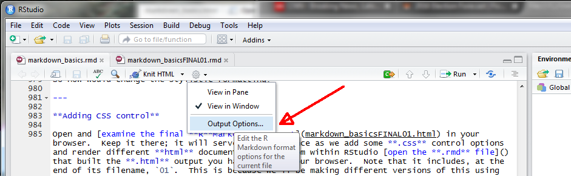
out.extra='style="background-color: #ffffff; padding:10px; display: inline-block;"'
--->

```{r f08, echo=FALSE, fig.cap="GUI dropdown for selecting output options.", out.width = '50%', fig.align="center"}

```

Click the **Output Options**.  This opens a new drop-down.  At the top you can choose HTML, MS WORD, or PDF.  For now, make sure HTML is selected.  Note that the **syntax highlighting** and **Apply theme** boxes are checked, and that they show **default** (Fig. \@ref(fig:f09)).

<!--
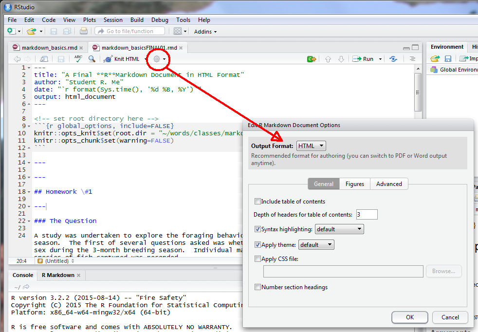
out.extra='style="background-color: #ffffff; padding:10px; display: inline-block;"'
--->

```{r f09, echo=FALSE, fig.cap="GUI dropdown for selecting highlight and theme options.", out.width = '50%', fig.align="center"}

```

Here is where you can add one of RStudio's "canned" formats.  First, make sure you've opened the `markdown_basicsFINAL01.rmd` file in RStudio.  Next, follow the process above and pick a syntax from the list.  I selected **haddock** (mostly because it is a wonderful fish for eating, not for any specific **R**Markdown reason).  Before hitting **Ok** be sure you are looking at the YAML in the `markdown_basicsFINAL01.rmd`.  Hit **Ok**, and observe how the YAML has changed.  It now includes; nested under the YAML `output: html_document:` a new option called `highlight: hadddock`.  

```
#### YAML now includes RStudio highlight option that links to a CSS-type file
---
title: "A Final **R**Markdown Document in HTML Format"
author: "Student R. Me"
date: '`r format(Sys.Date(), "%B %d, %Y")`'
output: 
  html_document: 
    highlight: haddock
---
```

Last, save the document as `02` version, and then knit.  [Open the version](https://maddoor1.nr.usu.edu:45231/sharing/qlSHxRTUc) `02` HTML in your browser and compare to the `01` HTML version.  The first (and only) difference is the code syntax, and it is colored.

Next, pick a theme (I chose cerulean, liking deep sky blues) and save the change with your chosen theme as version `03`.  Once again, the YAML will change - `theme: cerulean` has been added - as will the [knited document](https://maddoor1.nr.usu.edu:45231/sharing/lXb4vGt7o).  Once again, it differs.  In this example, the YAML `output: html_document:` will now also include a `theme: cerulean`.

Try as many highlights and themes as you wish.  

### Adding CSS control from within RStudio

Much like `highlight:` and `theme:`, the `css:` call is placed within the the YAML `output: html_document:` section.  An example would be  `css: FILENAME.css`.  **NOTE** you must set `theme: null` or the render will crash.

```
#### YAML now includes css: option that explicitly links to a CSS file
---
title: "A Final **R**Markdown Document in HTML Format"
author: "Student R. Me"
date: '`r format(Sys.Date(), "%B %d, %Y")`'
output: 
  html_document: 
    css: FILENAME.css
    highlight: haddock
    theme: null
---
```

You can either build your own CSS file, obtain one from elsewhere, or obtain and modify an existing CSS file.  They are relatively [simple to build](http://www.w3schools.com/html/html_css.asp) from within any basic text editor.  A great place to start for **R**Markdown-related CSS files is this [GitHub site](https://github.com/jasonm23/markdown-css-themes), which includes a dozen or so different CSS files you can use.  There's a [companion website](https://jasonm23.github.io/markdown-css-themes/) that allows you to see differences among the RStudio styles.  Check it out.

Because the CSS file controls stylistic elements such as font, size, and color, it best to either not include the `highlight:` and `theme:` options within the YAML, or set them to `null`, if a CSS control is being implemented.

## Other RMarkdown Formats

As previously noted, there exist numerous [formatting options for Markdown documents](https://blog.rstudio.org/2016/03/21/r-markdown-custom-formats/).  Two default formats within RStudio are MS WORD and PDF, both of which are accessible from the same drop--down menu location where the `Knit HTML` is found (Fig. \@ref(fig:f10)).

<!--
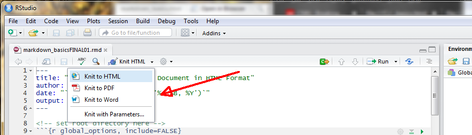
out.extra='style="background-color: #ffffff; padding:10px; display: inline-block;"'
--->

```{r f10, echo=FALSE, fig.cap="GUI dropdown for PDF and MS WORD outputs.", out.width = '50%', fig.align="center"}

```

### MS WORD Format

To convert the **R**Markdown document to a MS WORD format simply click the `Knit to Word` on the dropdown shown above.  That's all there is to it.

The [doucment returned](https://maddoor1.nr.usu.edu:45231/sharing/kPJA8JZHv) is typically "Read--Only," and might require saving or changing the View (i.e., View => Edit Document) so that it can be edited if desired.  This is largely system dependent and can only be determined by experimentation on your part.  

The `Knit` process does a reasonably good job of converting most figures, although occasionally you may have to return to your R code and rescale some of the plot elements, such as the `cex =` used in text labels or legends.  Note below how the YAML in a `Knit to Word` document looks; output has changed from `html_document` to `word_document`.

```
#### Basic MS WORD YAML 
---
title: "A Final **R**Markdown Document in HTML Format"
author: "Student R. Me"
date:  '`r format(Sys.Date(), "%B %d, %Y")`'
output: 
  word_document: default
--- 
```

But what if you do  not like the MS WORD defaults, which here are blue headers, a Cambria font of 12 pitch, as well as other defaults?  

Much like we used a CSS file to control format of HTML documents, we can use a MS WORD template to control the stylistic format.  However, unlike there being several CSS--type defaults for HTML format in RStudio, as well as several CSS options found on GitHub and elsewhere, there are few "canned" MS WORD templates available.  You need to build one.  The steps are reasonably simple:

* Build a **.rmd** template file containing all possible, desired output you can ever imagine in a MS WORD document, such as:  
    * Headers, bold, italics, and all other format controls described above  
    * External web links  
    * Embedded pictures / video  
    * Tables  
    * Mathematical symbols and equations  
    * Embedded R code, including a plot 
* Knit the document as MS WORD output  
* Open the MS WORD document  

Once open, from the `Home` tab click the lower right of the `Styles` section.  This will open an adjoining panel of Styles options to the right (Fig. \@ref(fig:f11)). 

<!--
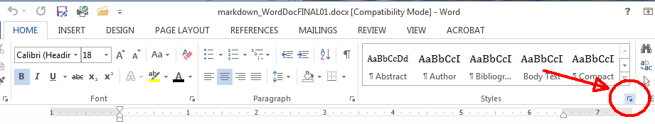
out.extra='style="background-color: #ffffff; padding:10px; display: inline-block;"'
---> 

```{r f11, echo=FALSE, fig.cap="Creating a MS WORD template: accessing the Styles Section.", out.width = '50%', fig.align="center"}

```

Highlight a segment of the document, such as text in the first paragraph.  Next, scroll down the `Styles` panel until you find a highlighted section (here, First Paragraph).  This represents the MS WORD Style associated with that section of the document.  Click the First Paragraph symbol $\blacktriangledown$ (carrot), which opens a drop--down.  Click `Modify`, and then change the format to whatever is preferred.  The `Modify` merely implements any of the possible format options found in a standard MS WORD document (Fig. \@ref(fig:f12)).  

<!--
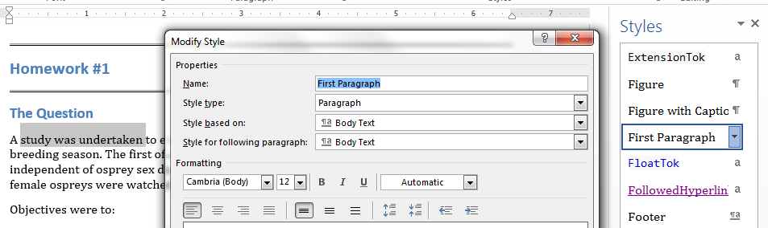 
out.extra='style="background-color: #ffffff; padding:10px; display: inline-block;"'
---> 

```{r f12, echo=FALSE, fig.cap="Selecting a section of MS WORD and applying a style.", out.width = '50%', fig.align="center"}

```

Repeat this process for all snippets of output that you wish to format.  Once completed, save the document, giving it some sort of name like `word_RMarkdown_templateV01.docx`.  The final step is to reference the MS WORD template in the YAML using the `reference_docx:` option.  As the **R**Markdown file is processed, it uses the specified formats in the `reference_docx:`.  There will be, on occasion, formats that simply will not cross--over from **R**Markdown to a MS WORD document, such as a system calls.  You will learn what these are mostly through personal trial and error.

```
#### MS Word YAML with reference to a WORD template
---
title: "A Final **R**Markdown Document in MS WORD Format"
author: "Student R. Me"
date:  '`r format(Sys.Date(), "%B %d, %Y")`'
output: 
  word_document:
    reference_docx: word-styles-reference-01.docx
--- 
```

One final note.

The process to construct a MS WORD document using **R**Markdown is very well described in [a post by R. Layton](http://rmarkdown.rstudio.com/articles_docx.html), and I encourage you to check it out.  He goes into much greater detail that I describe here.  Remember, you need only build this MS WORD template once and then access it when you wish to use **R**Markdown to construct a MS WORD document.  It can take a while until you are satisfied with the formatting, but once the template is constructed and saved it is very easy to build MS WORD documents that mirror your preferred HTML format. 

### PDF format

Conversion to PDF directly from **R**Markdown is somewhat complex, mostly because it requires installation of TeX.  There's a separate vignette for PDF output that will walk through installation of TeX on your CPU.

#### The Lazy Person's Approach

Don't fight City hall.  Build the MS WORD document using a template of your choice, then convert the document to PDF in MS WORD. 

---

# The End !! 

---


