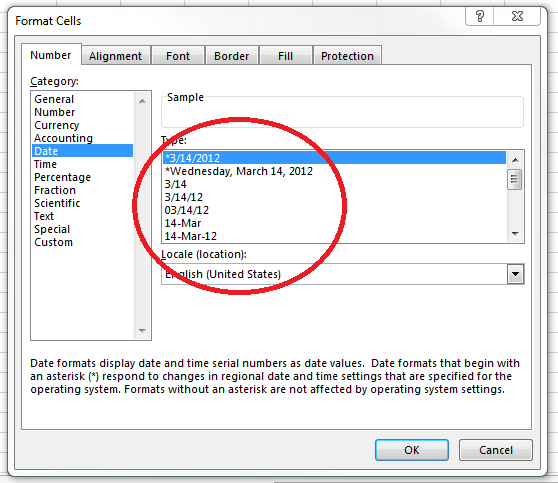
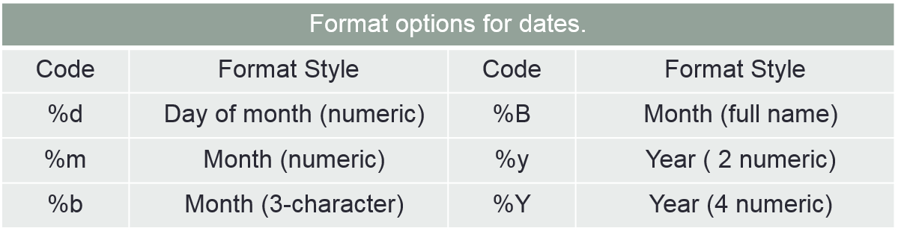

<!--
---
title: "Thoughts on Using Date and Time in R"
output:
  bookdown::pdf_document2:
    fig_caption: yes
    toc: false
    toc_depth: 3
    keep_tex: TRUE
    number_sections: yes
  bookdown::html_document2:
    fig_caption: yes
    highlight: haddock
    number_sections: yes
    toc: yes
    toc_depth: 3
    toc_float: yes
urlcolor: blue
---
-->

<!-- set root directory here --> 
```{r global_options, include=FALSE}
knitr::opts_knit$set(root.dir = "~/words/classes/baseR_ALLversions/baseR_datetime/datetime_html")
knitr::opts_chunk$set(warning=FALSE,error=TRUE)
```

Last update: `r format(Sys.time(), '%d %B %Y')` (V2019.2)

---

## Purpose of this Vignette

This vignette explores some of the nuances associated with the use of date and / or time in R.  It serves as a Supplemental to baseR, Module 3.3, Specialized Data Distinctions.

**Bypass the Webpage:**

* Click here to [download and obtain a PDF](https://maddoor1.nr.usu.edu:45231/sharing/qW2WcdAFs) of this vignette.

---

## Why Use R--based Date and Time Values?

Most ecological data has date and / or time values associated with measurements.  Some examples might include GPS--collars on ungulates, which collect data on the date and time an individual is recorded at a particular geographic location, or pit tags in fish which record a date or date and time when a fish migrates through a stream and past a recorder.  Other examples are a bit more mundane, such as field sample dates, or re--visit dates to a sample point associated with an occupancy modelling effort on birds.  Irrespective of intent, all still involve collection and analysis of date and / or time.

The bottom line: we record date and / or time for a host of reasons that aid us in analysis and interpretation, and storing date and / or time as R--based values is to your advantage.

R--based date and time formats have the advantage of allowing for arithmetic operations, mostly where you determine date or time intervals via addition or subtraction.  R, in fact, also has a several built--in functions that perform these as well as other operations, such as determining Julian dates.  Some examples of where this could be useful would determining re--sight date intervals for a Mark--Recapture study, or time intervals of behavioral actions performed by animals.  

## The Date:Time Conversion Process in R

The conversion of externally recorded dates and times into R--based formats can be complex, and careful attention must be paid to formats of raw data input, how those data are imported and how R internally views the imported data, and what the desired outcome and application of the R--based date and time formats is to be.

Most of us (for better or worse) use MS Excel for data entry and storage.  Being proprietary software, MS Office products store date and time *per* the software, a form of data formatting that does not necessarily "talk" well with R and how R stores date and time.  Moreover, dates and times can be entered into a standard `.csv/.xlsx/.xls` spreadsheets in many different forms, some of which for date are shown in the Fig. \@ref(fig:fig01) below.  (To see more date and time options available in Excel, go to HOME => Number => Number tab => Date.)

<!-- {width=480px} --->

```{r fig01, echo=FALSE, fig.cap="Date and time format options in MS EXCEL", out.width = '50%', fig.align="center", out.extra='style="background-color: #ffffff; padding:10px; display: inline-block;"'}

```

Although R has options to import data from many different types of data structures, the two file types most commonly imported into R are `.csv` or `.xlsx/.xls`.  Each of these file types stores dates and times in visually similar formats, but importing date and time from from each results in different data characteristics (i.e., `class`) in R.  You need to understand these source file--specific effects before importing dates and times.

Last, it is good idea to have some expectation of how the R--formatted dates and times is to be used, such as whether the entire spectrum of options ranging from years to seconds, including variants such as time zone and daylight savings effects, to simply concentrating on days alone.  

Consequently, three issues to consider before proceeding to work with date and time in R are:

* The originating file type being imported into R;
* The raw (import) data format(s); and
* What are to be some eventual operations performed on the dates and times.  

We'll begin with `.csv` file imports and then consider imports of `.xlsx/.xls` files.  As you will see below, some R date and time functions work irrespective of the import file type, and some are particular to file type.

---

##  Importing Date and Time from .csv Files

The imported `.csv` file shows the different formats of how the dates were stored in the original `.csv` file and imported into the R object `d1`.

```{r d01, echo=3}
# import some date formats from .csv file
  d1 <- read.csv("data/dateformats.csv", header = T)
  head(d1, 2)  # examine dataframe
```

Next, `str()` returns the class of all the dates, which for all variables in this example is of R class `Factor`.  As we will see below, the `class` determination is of importance when converting dates and times to their R--based analogues.

```{r d02}
  str(d1) # examine class of MS excel dates imported into R
```

The trick, then, is to convert these `.csv` date formats into an R date format, thereby allowing access to a host of R functions that can use R--formatted dates.

## So How Do I Create R--based Date and Time Objects?

There are several packages for creating date and time formats in R.  These include, but are not limited to, functions within the R <a href="https://www.rdocumentation.org/packages/base/versions/3.5.1/topics/as.Date" target="blank">`base`</a> packages, <a href="https://cran.r-project.org/web/packages/chron/index.html" target="blank">`chron`</a>, <a href="https://lubridate.tidyverse.org/" target="blank">`lubridate`</a>, <a href="https://cran.r-project.org/web/packages/xlsx/index.html" target="blank">`xlsx`</a>, and <a href="https://cran.r-project.org/web/packages/readxl/index.html" target="blank">`readxl`</a>.

## The base Package:  Using the as.Date Function

Before proceeding further, recall from above that the class of `date1`, `date2`, and `date3` was that of`Factor`.  Do other R classes work with `as.Date` as well?  If so, what are these?  

The required class for `as.Date` is character.  In this case, `Factor` is a character set as well, so the `as.Date` conversion will work.  To be safe, however, you could apply `as.character` coercion to the data, thereby ensuring with certainty that the input values are of class `chr`.  We'll see an example of that below.

The `as.Date` process assumes a default input format of YYYY--MM--DD, such as "2017-10-6".  Thus, if your data input is **not** in that format after importation into R, errors in the conversion will occur and you might not be aware of them!  

For example, note below that the variable `date1` gets converted, but for the first datum the year "2003"" was converted to year "0005", or a date approximately 2 millennia ago!  Others are converted to `NA`, an appropriate value as far as R is concerned but clearly wrong in terms of the dates in the original `.csv` file.

```{r d03}
# what happens if wrong date format assumed?
  as.Date(d1$date1)  # conversion without proper formatting
```

The solution is to use the `format =` option within `as.Date` and specify how the format of the input dates looks.  These options are shown in (Fig. \@ref(fig:fig02)).  The solution is simple -- pick the one that mimics your import data and use that in the `format =` option.

<!-- {width=480px} --->

```{r fig02, echo=FALSE, fig.cap="R--based input format options for date", out.width = '65%', fig.align="center", out.extra='style="background-color: #ffffff; padding:10px; display: inline-block;"'}

```

So if the input format of `date1` is ....

```{r d04, echo=F}
# input format of date1
  d1$date1
```

... then the appropriate format option for conversion to a R-based date is `format = "%m/%d/%Y"`, given the coding options shown in the table above.  This results in a correct conversion of your input dates to an R date.  

```{r d05A}
# convert input format of date1 using format=
  as.Date(d1$date1, format = "%m/%d/%Y")
```

**NOTE** that in the next conversion we apply the `as.character` wrapper as well, thereby temporarily coercing `date1` to character class before the conversion to a R--based date.  Both result in correct conversions.

```{r d05B}
# convert input format of date1 using as.character & format=
  as.Date(as.character(d1$date1), format = "%m/%d/%Y")
```

For `date3`, which is of input format "5-May-03", the conversion catechism from the table above is "%d-%b-%y".

```{r d06}
# convert the input format of date3 using format=
  as.Date(d1$date3, format = "%d-%b-%y")
```

Simple enough, right?  

To ensure proper conversion you need to remember the `class` of the date input -- both `Factor` and `chr` work -- and ensure you have told R the format of the input date data.  Personally, I always add the converted date as a new variable to the data frame, thereby ensuring I still have the original values as well.  Your call, but here's one way to do it. 

```{r d07}
# convert the input format of dates & add to dataframe
  d1$r.date1 <- as.Date(d1$date1, format = "%m/%d/%Y")
  d1$r.date2 <- as.Date(d1$date2, format = "%m/%d/%y")
  d1$r.date3 <- as.Date(d1$date3, format = "%d-%b-%y")
  head(d1, 2)  # examine dataframe
```

One last observation.  Once converted to a date format, the `class` becomes `Date` for the three new variables as shown below.  

```{r d08}
# examine dataframe and var structure
  str(d1)
```

You're done!

## Using the `chron` Package:  Both Date and Time

If you plan to use time, either as a standalone variable or combined with date into a date:time variable, consider the `chron` package.

`chron`, and its `dates` and `times` functions, has the advantage over the base `as.Date` given it can handle both date and time in one convenient call.  It can create a date:time object of "year:month:day:hour:minute:second" format.  This object can, as with values from `as.Date`, be subjected to a variety of arithmetic operations.

### Date in `chron`

Consider the data below, which consist of both a date column and a time column.  As above, we have date imported with a particular format -- not the default R format -- and now have a time format of "HH:MM:SS".  `str` indicates both are of class `Factor`.

```{r d09}
# import some date formats from .csv file
  d2 <- read.csv("data/datetimeformats.csv", header = T)
  head(d2, 2)  # examine dataframe
  str(d2)  # dataframe structure
```

The two basic calls in `chron` are `dates`, which as the name implies converts dates into to a R--based date format, and `times`, which does the same for time formats.  Although class `factor` was considered as character using `as.Date`, this is not the case for the `dates` call.  The input date values must be coerced into class `chr` before `dates` will work.  Simply applying `dates` without the date being of class `chr` will return an error.  

### Time in `chron`

For reasons beyond this mere mortal's comprehension, `times` does **not** require coercion to class `chr` but works okay with class `Factor`.  As with `as.Date`, both `dates` and `times` can accept inputs of differing formats.  These are specified in the `chron` option `format = c(dates = , times = )`.  `dates = ` is of any YYYY:MM:DD sequence.  `times =` can be in any permutation of HH:MM:SS separated by non--special characters like ":" or "-".  See `help(chron)` for specifics; not all format options are presented here.

```{r d10}
# convert some date & time formats using chron
  library(chron)  # load chron library
  dates(as.character(d2$date))  # convert to chron date
  times(d2$time)  # convert to chron time
```

You can also combine the `chron` functions into a single call as shown below.  Note how the combined date:time is portrayed in the output.

```{r d11}
# convert some date & time formats using chron
  chron(dates = dates(as.character(d2$date)), 
   times = times(d2$time)) # both chron date time
```

As indicated above, these conversions could be added to the dataframe if desired.

```{r d12}
# build new dataframe and examine structure
  d2$c.date <- dates(as.character(d2$date))
  d2$c.time <- times(d2$time)
  d2$c.datetime <- chron(dates = dates(as.character(d2$date)), 
   times = times(d2$time))
  head(d2, 2)  # examine dataframe
  str(d2)  # examine data structure
```

**NOTE** that `chron` creates a different class than does `as.Date`, as well as storing dates in a different R--based format.  This internal R format keeps track of all the year to seconds elements of the date:time objects.

## The `lubridate` Package:  Your Best Bet for Date and Time

### Dealing with Dates

Let's start again with a fresh set of dates, re--importing the same dataset we employed for the call `as.Date` from the base package.  We'll call it `d3` this time.

```{r d13, echo=3}
# import some date formats from .csv file
  d3 <- read.csv("data/dateformats.csv", header = T)
  head(d3, 2)  # examine dataframe
```

Conversion for combinations of day, month, and year using `lubridate` is quite simple -- examine the sequencing of of the input format, where day = `d`, month = `m`, and year = `y`, and employ `lubridate` functions based on the sequencing of the three letters, `d`, `m`, and `y`.  Thus `dmy` is for day--month--year, `mdy` for month--day--year, and so forth for all the sequencing combinations.  There is no need to apply a `format =` option as we did when using `as.Date` !!  `lubridate` automatically handles those conversions internally.

**NOTE** the default input functions of `lubridate` return data of `class = Date`.  See `help(lubridate)` or `help(dmy)` (or any the `d`, `m`, `y` sequences) for differenrt `class =` and other options.

**Yet Another NOTE** is that `lubridate` masks quite a few other functions.  Consequently below I'm using the `package::function` method.

```{r d14}
#library(lubridate)
d3$r.date1 <- lubridate::mdy(d3$date1) # input format: 5/5/2003
d3$r.date2 <- lubridate::mdy(d3$date2) # input format: 5/5/03
d3$r.date3 <- lubridate::dmy(d3$date3) # input format: 5-May-03
head(d3, 2) # examine dataframe
str(d3) # dataframe structure
```

Simple enough!

### Consider Time

Time is added in a similar fashion using labels of `h` = hour, `m` = minute, and `s` = seconds.  Thus, to mimic `chron`'s date:time capability, apply the call `mdy_hms`.  

Consider again the data below, which consists of two columns, one of **date** in MMM/DD/YYYY and one of **time** in HH:MM:SS. (Remember, the variants in the `m`, `d`, and `y` depend on the sequencing of the input data.) For the `mdy_hms` to work the date and time must first be concatenated using `paste`, and then the `mdy_hms` call applied.

```{r d15A, echo=3:5}
# import some date formats from .csv file
  d4 <- read.csv("data/datetimeformats.csv", header = T)
  head(d4, 2)  # examine dataframe
  d4$r.datetime <- lubridate::mdy_hms(paste(d4$date, d4$time, sep = " ")) # date-time
  str(d4)  # dataframe structure
```

Once again, you're done !! You now have an alternative (and somewhat easier) way to create data. time, and date:time variables for use in R analyses.  The only other **NOTE** is `class` is no longer `Date`, but that of `POSIXct`.  We'll discuss `POSIXct` and it's cousin `POSIXlt` below.

```{r d16, eval=F, echo=F}
# is this useful code for some other place ??
#library(lubridate)
unlist(d4$r.datetime)
lubridate::wday(d4$r.datetime, label = TRUE)
```

---

## Importing Date and Time from MS Excel .xlsx / .xls Files

Okay, I get it.  

Some of you just can't let go of MS EXCEL products.  So let's see what happens using dates and times imported directly from `.xls/.xlsx` files using two different packages, `xlsx` and `readxl`.  **NOTE** that the second package is the "default" GUI importation for `.xls/.xlsx` files in RStudio.

## Package `xlsx` and Date and Time

Quoting directly from the `xlsx` package as developed by Adrian A. Dragulescu, "*The xlsx package gives programatic control of Excel files using R [and] allows the user to read a sheet of an xlsx document into a data.frame and write a data.frame to a file.*"  While `xlsx`  works fine with simple numeric and character data types, how well does it deal with dates and times?  First, **NOTE** that you will need the `rJava` and `xlsxjars` R packages installed, as well as both 32-- and 64--bit versions of Java to support the `xlsx` package.

### Importation of Dates from MS EXCEL

Notice that data object `d3` contains variables **date2** and **date3**, which were of `.xlsx` formats of "5/5/03" and "5-May-03," respectively, and which were automatically converted to the "YYYY--MM--DD" R format.  `date1` was not.

```{r d20, echo=4}
# import some date formats based on .xlsx/.xls files
  library(xlsx)  # load a library for importing xlsx files
  d3 <- read.xlsx("data/dateformats.xlsx", 1)
  head(d3, 2)  # examine import from .xlsx
```

In addition, the class is now `Date`, which is identical to that after earlier conversions using `as.Date` above.  

```{r d21}
# examine structure after .xlsx import
  str(d3)
```

Bottom line is that while direct import of a `.xlsx` file with dates works for some date formats, it does not work for all, and conversions similar to those shown for dates imported using `.csv` files (e.g., `as.Date`) will still have to be used in some cases.  So other than being aware you might need to apply a format option to some types of dates, the result is not too different from importation of dates from a `.csv` file.

### But What About Time?

Well, there seems to be an issue when time is a standalone variable (i.e., without an associated date value) is imported, the most obvious being some sort of date -- "1899-12-30", the next--to--last day of the 19th century? -- now associated with the time stamp of "13:08:40."  Variable `datetime`, a combined date and time format, looks okay and mirrors the raw data format of the `.xlsx` file.  In addition, we see a new R class for time -- the `POSIXct` -- for both `time` and `datetime`.

```{r d22, echo=3:4}
# import some date formats based on .xlsx/.xls files
  d4 <- read.xlsx("data/datetimeformats.xlsx", 1)
  head(d4, 2) # examine dataframe
  str(d4)
```

But before diving into the murky world of `POSIXct`, and its cousin `POSIXlt`, let's see how another direct import of `.xlsx/.xls` files deals with the same dates and times.

## Package `readxl` and Date and Time

This package also directly imports MS EXCEL sheets, and is the GUI--driven drop--down default package for MS EXCEL imports in RStudio as well.

### Back to Dates Aagin

As with `read.xlsx`, the `read_xlsx` function within package `readxl` properly converted `date2` and `date3` to R's "YYYY--MM--DD" format.  However, the same cautionary note from package `xlsx` also applies -- not all date formats will be correctly imported and additional functions such as `as.Date` may be required.

```{r d25, echo=3:4}
# import some date formats based on .xlsx/.xls files
  library(readxl)  # load another library for importing xlsx files
  d5 <- read_xlsx("data/dateformats.xlsx", 1)
  head(d5, 2)  # examine dataframe
```

Applying `str` to the imported object `d5` returns, as with `read.xl` above, a class of `POSIXct` for the date values.  Once again we see a new and different class resulting from data imports directly from `.xlsx/.xls` files.

```{r d26, echo=F}
# examine structure after .xlsx import
  str(d5)
```

### And What About Time--Related Values?  

Once again note that a strange year -- "1899-12-31" -- has been added to the `time` import format of HH:MM:SS, while `datetime` once again looks okay.  However, the date added is for "31 Dec 1899," not "30 Dec 1899."  But unlike in package `xlsx` above, which imports variable `date` as class `Date`, and variables `time` and `datetime` as class `PSOXct`, package `readxl` at least converts all three variables to class `POSIXct`.  

```{r d27, echo=4:5}
# import some date formats based on .xlsx/.xls files
  library(readxl)  # load another library for importing xlsx files
  d6 <- read_xlsx("data/datetimeformats.xlsx", 1)
  head(d6, 2)  # examine dataframe
  str(d6)
```

What's going on with `time`?  And what does class `POSIXct` have to do with both date, time, and date:time R formats?  Is this an issue related only to direct importation of `.xlsx/.xls` files?  Why do two packages that purportedly import `.xlsx/xls` files directly lead to different R classes, as well as, in at least for `time`, different dates being added?

---

## The R Classes of `POSIXct` and `POSIXlt`

Both of these R classes deal with calendar date and time.  

The first, `POSIXct`, represents a date as the number of positive seconds from R's arbitrary start date of 1 January 1970, or negative seconds going backward in date from there. The seconds are pegged to Greenwich Mean Time (or Universal Time Coordinated) meaning the value is off by seven hours (25,200 seconds) given my location in Utah, ignoring daylight savings effects for now. 

`POSIXlt` is a list of vectors including, in sequence, those for (1) seconds, (2) minutes, (3) hours, (4) day of month, (5) month (Note: January = 0), (6) year since 1900, (7) day of week (Note: Sunday = 0), (8) year of day (Note 1 January = 0), and (9) a flag for daylight savings time.  

Both formats allow for arithmetic operations, and any date elements such the year or month or hour can be extracted.  Extraction examples from each are shown below, bearing in mind that `POSIXlt` is a list and, as such, values must be extracted using R list notation.  As part of the extraction examples, we convert the `POSIXct` format to `POSIXlt` and then extract the hour, minutes, and seconds vectors. 

```{r d28}
# extract elements from POSIXct and POSIXlt formats 
  format(d6$date, "%Y")  # extract year from a POSIXct date
  format(d6$time, "%H")  # extract hour from POSIXct time
  
# convert POSIXct to POSIXlt format
  d6$plt.datetime <- as.POSIXlt(d6$time)
  d6$plt.datetime[1 ,] # examine 1st obs
  unlist(d6$plt.datetime[[1]])  # extract all elements of 1st obs
  d6$plt.datetime[, 2] # extract mins - element 2 - from all obs
```

We do have a clue here for the strange date of "1899-12-31" attached to our time values.  Recall that our raw data column was simply a time of format HH:MM:SS.  No date was attached.  What the `.xlsx/.xls` imports of `read.xl` and `read_xlsx` do is automatically impose a date value onto data looking like a time value but without an accompanying date value.  Specifically, it  makes the conversion depending on how the data are actually stored in the `.xlsx/.xls` file.  The `.xlsx` example here has time stored as a MS Excel format of "Custom" with structure "h:mm:ss."  Absent any attached date value, the start year defaults to of 1 January 1900, or essentially the last second of 31 December 1899.

Confusing?  

You bet.  Welcome to the world of co--mingling proprietary software with freeware.

Should you worry about this arbitrary fixed date of "1899-12-31" in this circumstance?  The answer depends. If your intent is a comparison of times within a single day then the arbitrary date is of no consequence; merely perform your arithmetic operations since the date is a fixed scalar.  

However, if the intent is to merge the standalone time column with a standalone date column, as we did above using `chron`, then you have a lot of coding manipulation to perform, such as first extracting the time elements as shown in the code above, then attaching that to the date, and then converting it to an appropriate R--based format.   Whether this is worth the effort versus some other options shown here is your call.

---

## Some Summary Thoughts

As with everything R--related, you solve the representation of date and time in R dependent on your own needs and approaches to data management and manipulation in R.  Irrespective of that caveat, some thoughts to keep in mind, reflecting my personal solutions.

The first three things to keep in mind when dealing dates and time are:

* How the data are formatted in the raw, external file structure that is going to be imported into R;
* What is the file type being imported, the two most common being either `.csv` or `.xlsx/.xls`; and
* The intended operations to be performed on the date and time values.

These three things lead to the following recommendations, which I cheerfully admit are personal and hence biased!

* `.csv`--based date and time format and file type is the easiest to work with.  It requires fewer coding manipulations to convert into R--based date and time formats.  In this case package `lubridate` is perhaps easiest, although `chron` works equally well with for both date and time.
* If you wish to live (and die??) by MS Excel file types, spend some time outside R and convert the MS Excel date, time, and date:time to the appropriate formats in Excel **before** importing them into R.  Within Excel there are format options for dates and times, and the custom option can be used for date:time formats.  And for some silly reason Excel works on a 12 hour clock with "AM" and "PM" labels.  Go figure.
* Of the two R packages that directly import `.xlsx/.xls` file type, package `readxl` is best, if only because it is the RStudio default and because date, time, and date:time date are imported by default as class `POSIXct`.  No further conversions need be done.


