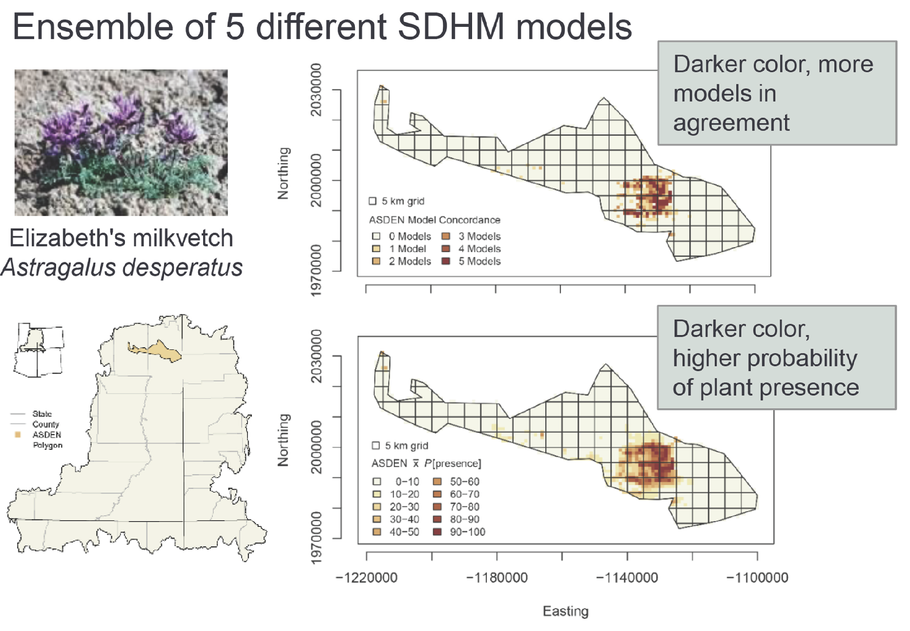

```{r, include = FALSE}
knitr::opts_chunk$set(
  collapse = TRUE,
  comment = "#>"
)
```

## Species Distribution and Habitat Modeling  
[CSP4220 FWS National Conservation Training Center](https://nctc.fws.gov/courses/descriptions/CSP4220-Species-Distribution-Modeling.pdf)

### Course Description 

This course will provide participants with the skills needed to build species distribution and habitat models (SDHMs) for use in management and conservation planning. Topics explored include:

* Data acquisition, organization, and vetting; 
* Model construction and prediction; 
* Assessment and evaluation; and 
* Decision-risk associated with SDHM implementation. 

Participants will learn to apply these skills in R through hands-on exercises, with an intent to transfer the skills learned to a SDHM related to their work environment. 

### Course Objectives 

Upon completion of this course, participants will be able to:

* Be conversant in the philosophical and ecological underpinnings of SDHMs
* Acquire, organize, and evaluate response and predictor data for a SDHM, with emphases on 
  * True presence:absence vs. presence-only data; 
  * The relationships of environmental an geographic coverage to sample frames; and 
  * Pre--analysis strategies for exploring characteristics of the response and predictor variables.
* Apply 5 different statistical methods to build predictive SDHMs
* Evaluate & assess SDHM performance, including estimation of uncertainties
* Construct, evaluate and present ensembles of SDHM outputs


```{r figCO01, echo=FALSE, fig.cap="Example output of a 5--model ensemble of SDHMs for Elizabeth's milkvetch *Astragulus desperatus*.", out.width = '75%', fig.align="center"}

```

