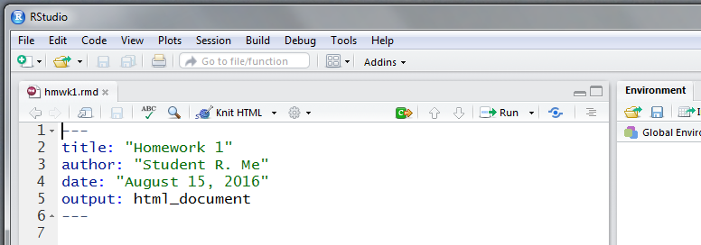

---
title: "KNIT the RMarkdown Document"
output: rmarkdown::html_vignette
vignette: >
  %\VignetteIndexEntry{0204-rmdBasics}
  %\VignetteEngine{knitr::rmarkdown}
  %\VignetteEncoding{UTF-8}
---


<!-- set root directory here
```{r global_options, include=FALSE}
knitr::opts_knit$set(root.dir = "~/words/classes/markdownR/markdown_html")
knitr::opts_chunk$set(warning=FALSE, fig.align="center")
```
-->

```{r, include = FALSE}
knitr::opts_chunk$set(
  collapse = TRUE,
  comment = "#>"
)
```

**Thomas C. Edwards**  
U.S. Geological Survey, Utah Cooperative Fish and Wildlife Research Unit, and  
Department of Wildland Ressources, Utah State University, Logan, UT 84322-5230 USA  

Last update: `r format(Sys.time(), '%d %B %Y')` (V2019.2)

---

# Purpose of this Vignette

This vignette describes how to build RMarkdown documents and output in a variety of different formats.  In fact, this is a RMarkdown document built within RStudio.

Expected outputs include RMarkdown files containing proper syntax for constructing documents, and conversion of the syntax into HTML, PDF, and MS WORD formats.

**Bypass the Webpage:**

* Click here to [download and obtain a PDF](https://maddoor1.nr.usu.edu:45231/sharing/ElEsCNhRV) of this webpage.

---

# What is Markdown?

Markdown is a form of [document markup language](https://en.wikipedia.org/wiki/Markup_language).  A document markup language is a way to distinguish basic text from other document elements, such as those that occur during an editorial review.  For example, by clicking the "REVIEW" tab on a MS WORD document you initiate a "markup" process where a reviewer's comments and editorial suggestions are shown on the document. 

[Markdown](https://en.wikipedia.org/wiki/Markdown) still involves embedding additional elements into a document, but has a slightly different purpose.  It evolved as means to embed formatting syntax into a document and have it rapidly and easily converted to a desired format.  You "markdown" text, including, for example, document formatting such as boldface, headers, lists, and mathematical symbols and equations, pictures, links to other files or webpages -- in short, just about anything you see on a webpage, journal article, or book, can be constructed using Markdown.  Formats are fairly flexible, including output in HTML format for browsers or many different text formats.

In the case of R, and Markdown as an example of a document Markdown language, it provides a means to embed - and actually run -- R code from within a single document, all using simple syntax coding.  This is addition to the text formatting mentioned above.

Cool!  Right?

Think about this for a moment in your role as a scientist:  By using Markdown you can fully replicate the analytical processes that underlay your research, showing the code you employ, the output it generates, be it numeric or graphical, plus text explanations about the analytical processes of your work.  It can be, for all intent and purpose, your research metadata.

Although not a necessary requirement, it is easiest to configure and generate Markdown output from within [RStudio](https://www.rstudio.com/).  However, command--line code from [Plain Vanilla R](https://www.r-project.org/), which is still used by Curmudgeonly Dinosaurs like me, can also be used to generate Markdown documents.  From this point forward I'll call documents integrating R coding R*Markdown documents so as to distinguish them from other types of Markdown documents.

---

## What Does the Output Look Like?

The most common outputs are HTML, MS WORD, PDF, or LaTeK.  R*Markdown is quite powerful, and there exists an ever--expanding list of [customized Markdown templates](https://blog.rstudio.org/2016/03/21/r-markdown-custom-formats/) including, for example, a template for all journals published by Elsevier.  You can also build a [book](https://bookdown.org/yihui/bookdown/), a [webpage](http://rmarkdown.rstudio.com/rmarkdown_websites.html), or just about any form of [document](http://rmarkdown.rstudio.com/formats.html) you can imagine.

But you should probably start simple.  And that's what this vignette is all about.

---

## Why Should I Learn to Use It?

Hopefully some of the advantages as outlined above answer this question.  

But another, pragmatic reason relates to classes, especially mine.  Historically, I've accepted just about any format for answers to exercises, quizzes, and tests in courses I teach.  MS PowerPoint or WORD have been the most common.  However, I now require R*Markdown as the means for evaluating coursework.

This is for two reasons.  A first reason is that as you begin your R programming adventures, you'll quickly learn that no "right" answer for implementing R code to meet an analysis objective exists.  You, as a student and researcher, will find a personal solution.  Other students and colleagues, one of them being perhaps more clever, might find a more efficient approach to a R coding issue.  Because one of the easiest ways for you to learn R is to see examples, R*Markdown documents provide a great way for me to post -- and you to see -- "clever" answers to R coding problems.

The second reason is one of convenience for me as the instructor, and you as the student.  I get a consistent, easy--to--read and evaluate document that includes your R code, the results of that code, as well as the rationale for your R analytical pathway, and your interpretation of your results.  You, the student, get a fully documented process by which you performed an analysis for future reference, a metaphorical trail of breadcrumbs by which you can answer the time--honored question all analysts eventually face:  

"How the \*\*\*\* did I actually do ***that*** analysis??!!??"

---

# Get Started and Build a RMarkdown Document...

We're going to use features found in RStudio as the foundation for instruction in building RMarkdown documents.  As we shall see, it has the advantage of some simple drop--downs for building, compiling, and editing the "code" used to build a RMarkdown document.

Note, however, that all the RMarkdown code as shown below will also work perfectly well in Plain Vanilla R.  So learn the RMarkdown coding process and worry later about how to compile the document.

## A quick overview of the process from within RStudio

The steps below will help you build a simple RMarkdown document.  There are many, many more options for creating RMarkdown documents, but the best approach to learning RMarkdown is to first learn how to build simple documents. You can then experiment with, and learn to apply, more sophisticated aspects of RMarkdown to your documents.

**To build a Markdown document from within RStudio ....**

* Open RStudio
    * Create a new RMarkdown file, __OR__ 
    * Open an existing RMarkdown file
* Configure the document style using a YAML header
* Add some text, including formatting to:
    * Embed headers of different pitch (font size)
    * Apply boldface, italics to phrases and words
    * Use Blockquotes and lines as separators
* Embed and execute R code 
* Include some fancy document stuff ...
    * Links to external web locations
    * Embed pictures and videos
    * Include tables
    * Add mathematical symbols and equations
* Save and compile (i.e., "Knit") the RMarkdown document

**NOTE** that although we're first learning how to build a RMarkdown document from within the RStudio editor, all the text and associated RMarkdown formatting could be entered into a basic text editor (e.g., [Notepad++](https://notepad-plus-plus.org/) for Windows 7/8/10 OS, [textmate](https://macromates.com/) for MAC Os), or even as a MS WORD document.  [**NOTE:** However, be careful using the latter; MS WORD carries special characters across depending on font (e.g., "" (quotes) in Times New Roman) that may not compile properly.]

---

## Create a New RMarkdown Document


Open RStudio.  You will first need to install the R package [`rmarkdown`](https://cran.r-project.org/web/packages/rmarkdown/index.html) and dependencies.  Note that your version of R must be $\geqq$ 3.0.  You should install the most current of RStudio as well, as it has recent features related to RMarkdown.

From the upper left of the RStudio window

* Click __File__ =>
* Click __New File__ =>
* Click __R Markdown__ 

<!-- set figures directory here 
#
#
-->

<!-- set figures directory here 
NOTE;  out.extra not working in PDF / TeX output
```{r echo=FALSE, fig.cap="GUI dropdown for creating a new RMarkdown document", out.width = '75%', fig.align="center", out.extra='style="background-color: #ffffff; padding:10px; display: inline-block;"'}
knitr::include_graphics("figures/md01.PNG")
```
-->

```{r f01, echo=FALSE, fig.cap="GUI dropdown for creating a new RMarkdown document.", out.width = '50%', fig.align="center", out.extra='style="background-color: #ffffff; padding:10px; display: inline-block;"'}
knitr::include_graphics("figures/md01.PNG")
```

This will open a GUI dialog box (Fig. \@ref(fig:f01)) asking which of the three basic RMarkdown documents types (i.e., HTML, PDF, MS WORD) you'd like to build.  It also shows dialog boxes for **Title** and **Author**.  For now, change the **Title** to ***Homework 1*** and **Author** to ***Your Name***.  Next, make sure the Document button on the upper left side is highlighted (blue color) and click on document type **HTML** (Fig. \@ref(fig:f02)).  This will open a default RStudio RMarkdown document destined to be compiled in HTML format.  The **date** of the document defaults to the date when the document is first opened.

<!-- set figures directory here 
#
#
-->

```{r f02, echo=FALSE, fig.cap="GUI dropdown for selecting document style and setting a few parameters.", out.width = '50%', fig.align="center", out.extra='style="background-color: #ffffff; padding:10px; display: inline-block;"'}
knitr::include_graphics("figures/md02.PNG")
```

For now ignore the text in the default document.  Merely highlight and delete the parts shown in blue (Fig. \@ref(fig:f03)), much as you would in MS WORD document.  

<!-- set figures directory here 


--> 

```{r f03, echo=FALSE, fig.cap="Be a cheater! Delete the verbiage highlighted in blue and save just the top five lines.", out.width = '50%', fig.align="center", out.extra='style="background-color: #ffffff; padding:10px; display: inline-block;"'}
knitr::include_graphics("figures/md03.png")
```

Once the deletion is done, 

* Click __File__ =>
* Click __Save As__ =>

and name the file something like **hmwk1.rmd**, where the **.rmd** file extension identifies the file as a R markdown document.

Close RStudio.  You've now created and saved a RMarkdown template.

## Open an existing RMarkdown document

Pretty simple:

* Click __File__ =>
* Click __Open File__ =>

and navigate to directory and open the file.  Use the **hmwk1.rmd** we saved from above.  It will appear as:

<!-- set pics directory here 


out.extra='style="background-color: #ffffff; padding:10px; display: inline-block;"'
--> 

```{r f04, echo=FALSE, fig.cap="The backbone of an HTML document.", out.width = '50%', fig.align="center", out.extra='style="background-color: #ffffff; padding:10px; display: inline-block;"'}

```

You now have the backbone template of a **R**Markdown document (Fig. \@ref(fig:f04)).

---

# The Building Blocks of a RMarkdown Document

## The Basic Structure - The YAML Header

All **R**Markdown documents begin with a **YAML header**, which originally meant "Yet Another Markup Language," but has since morphed to mean "YAML Ain't Markup Language."  The YAML header controls the format of the **R**Markdown document.  A basic YAML for a HTML document generated from within RStudio looks like the one found in our **hmwk1.rmd** file:


```
#### What a basic YAML looks like
---
title: "Homework 1"
author: "Student R. Me"
date: "August 15, 2019"
output: html_document
---
```

Of the four YAML elements shown above, only the **output:** is truly needed.  This YAML requests output be a **html_document**.  Some possible, but by no means all, **R**Markdown output types include:

* **output: pdf_document** (Adobe PDF)
* **output: word_document** (MS WORD)
* **output: beamer_presentation** (Adobe PDF slideshow)
* **output: ioslides_presentation** (HTML slideshow)

A more complete list of RMarkdown formats can be found [here](https://rmarkdown.rstudio.com/formats.html).

Other document control features, such as a CSS file that controls HTML output, or a MS WORD document template to control MS WORD output, can be added to the YAML.  More on that a bit later. 

## The Basic Structure -- The Text

```
####  Nothing special about adding text
This is text.  Just type away to your heart's content .... 

Use two hard returns to separate paragraphs (blocks) of text.
```

Click [here](markdown_basics01.html) [here](https://maddoor1.nr.usu.edu:45231/sharing/PTyR9X6nf) to see what the output looks like.  We'll learn more about how to configure text for bold, italics, and other text formatting features next.

## The Basic Structure -- Horizontal Line Separators

The most common use of horizontal separators is to distinguish among document sections.  You can add one, two, or any number of line separators.  Note a hard return and blank line is required after the first separator to generate two lines !!

```
#### Coding for line separators
The sequence of --- (three hyphens) adds a line separator to the document.

---

The sequence two sets of --- (three hyphens) separated by a blank line

---

---

adds two lines of separators.  
```
